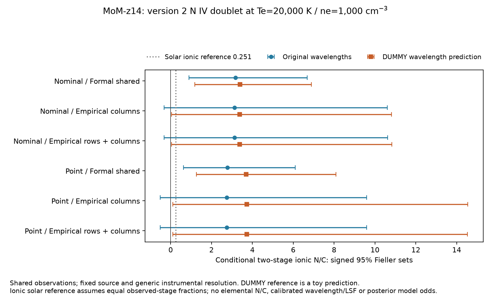

# JWST continuation: native spectra, persistent patches and quantitative model tests

9 October 2026. This report supersedes scientific conclusions in the incoming
master `1b4012e326664ce2a3ec5a515b5a832138aba46b` (PR #29) where new evidence
changes their scope. The incoming [verified status](TAKEOVER_BASELINE_PR29.md)
and [full report](FINAL_RESEARCH_REPORT_PR29.md) remain preserved. Read the
[current status](TAKEOVER_STATUS.md) first. Eight distinct specialists worked
on separate branches, with dependency-driven follow-ups and independent review;
[ownership and release rules](CONTINUATION_PROTOCOL.md) identify their roles.

**No new high-redshift source, elemental abundance, stellar polluter or
cosmological discovery is established.** The productive results are an actual
native-pixel reconstruction with shared-noise accounting, physical atomic
refits that weaken the nitrogen inference, repeat/multiband rejection of
several candidate premises, and reproducible predictions for further tests.

## Independently reproduced starting point

The coordinator inspected master and reproduced the locked Python 3.12 gate
(363 passed, two explicit historical-fixture skips), actual hashes of all 13
original images (1,555,571,520 bytes), and nine original CAL spectra. A fresh
GOODS pixel run reproduced both measurement CSV and selection metadata byte
for byte: 1,134 proposals, 891 untestable, 236 measured screen failures, seven
first-screen survivors over 0.9628081787 arcmin². Three catalog replays,
noise/chemistry sensitivity JSONs and a fresh nominal coadd fit/scan reproduced
the saved numerical baseline. See `research_output/continuation_baseline.json`.

The historical 1,732 candidates remain **untestable**, not measured artifacts.
Six of the seven GOODS survivors fail persistence at their original brightness;
98 persists. Conditional entrants 254/46 have separate denominators. The matched
SMACS selection had 1,267 proposals, 940 untestable, 317 failures and ten raw
survivors. None of these counts is a redshift-confirmed population.

A transient cache disappeared late in the session. Completed pixel reruns,
committed measurements and reviewer receipts survived. The exact locked runtime
and all nine native originals were restored; the latter transferred 464,135,040
bytes with every original pin matching. The old 13-image cache is no longer
present. `research_output/native_cache_recovery.json` records recovery, rather
than implying an unexecuted second image rerun.

## Persistent imaging candidates

### A distinct SMACS repeat and field-specific noise

A bounded acquisition obtained a different F444W exposure,
`jw02736001001_02105_00003_nrcalong_i2d.fits` (120,254,400 bytes). Its sole
uncalibrated contributor is disjoint from reference exposure 00004. Both have
837.468-s exposure time, separated by 15.3888 minutes in one visit. Of ten raw
survivors, nine fail nominal persistence; 1043 retains a fixed-aperture red
patch. With tripled errors eight fail and 152 becomes inconclusive. The nearest
repeat segmentation centroid to 1043 is 0.951 arcsec away, so patch persistence
is not evidence of an independently segmented compact object. Coordinate shifts
of ±0.05 arcsec leave this conclusion stable. There were 345 astrometric training
and 352 held-out matches; the raw median/p90 residuals are 0.01303/0.04451 arcsec.
[Repeat report](SMACS_INDEPENDENT_REPEAT.md).

Actual SMACS blank apertures yield noise/diagonal-error factors F090=1.184
[1.081,1.351], F200=1.285 [1.183,1.380], F444=0.938 [0.894,0.979]. These are
conditional spatial-block intervals, with adjacent-pixel correlations about
0.50/0.52/0.69. Held-out F444 apertures include one negative five-sigma event and
no positive event: this does not certify a Gaussian five-sigma false-positive
rate. A negative-image selection has no passes among five testable proposals,
not a population contamination estimate. Field-specific corrections can change
candidate identities; GOODS factors cannot simply transfer to SMACS.
[Noise controls](SMACS_EMPIRICAL_CONTROLS.md).

For 1043, the original F090 aperture is −40.30±6.45 nJy after subtracting
649.75 nJy of annulus background from 609.45 nJy of unsubtracted signal. Nine
point-plus-background alternatives give positive point coefficients 31.33–44.57
nJy, while source-excluded background apertures span −12.08–92.15 nJy. Red
residual chi²/dof remains 11–28. A red patch persists; a background-independent
blue non-detection and precise calibrated point flux do not follow.
[Actual patch models and figure](SMACS1043_PATCH_DIAGNOSTICS.md).

### Deep seven-band GOODS models

Twenty-one bounded DAWN cutouts, seven finite PSFs and seven SVO bandpasses
support forward modeling of 98/254/46. Their mosaics share native contributors
with earlier observations. Reused photons are not independent confirmation.
The model transports source geometry and local background jointly into blank
controls; review found and corrected a companion-offset defect before merge.
[Acquisition](SURVIVOR_DEEP_DATA.md), [deep models](SURVIVOR_DEEP_MODEL.md).

| Source | Executed evidence | Supported interpretation |
|---|---|---|
| 254 | F090 aligned flux 17.84±0.81 nJy, conditional background error; blue/red centroid separation 0.010 arcsec. Alternative radii, PSF rotation and apertures remain positive. Independently computed mean/planar annulus alternatives give 18.47–19.01 nJy. | The premise of no blue counterpart fails. This alone does not determine a redshift. |
| 98 | A second red knot lies 0.336 arcsec away. F090 target flux changes from 10.16 to 4.14±2.45 nJy under one/two-component fits and to −0.71 nJy under a smaller window. F444 diagonal chi² is still 184,658/525. | A persistent complex is supported; the current spatial model and tiny formal errors do not certify component totals or a dropout identity. |
| 46 | Approximate conditional fν in F115/F150/F200/F277/F356/F444 is 3.91/3.00/2.12/9.74/68.69/644.88 nJy; F444/F356=9.39, F356/F277=7.05. | Strong curvature is measured; a simple smooth continuum family is inadequate. |

A publisher-pinned Sonora Bobcat 2021 table adds **1,052 evaluated cloudless,
equilibrium atmosphere rows** for source 46. All perform poorly under the adopted
5%/15% floors: best conditional chi²=171.49/49.38. The best model predicts
F277≈1.36 nJy versus 9.74 nJy measured; holding F277 out predicts ≈1.35 nJy.
Independent author-table parsing and NNLS reproduce the fits. This rejects that
finite grid as a satisfactory explanation, not cool atmospheres as a class.
Clouds, nonequilibrium chemistry, other stellar/galaxy models and multiplicity
remain open. Any distance or proper-motion prediction from its inadequate best
model is explicitly hypothetical. [Atmosphere comparison](SURVIVOR_ATMOSPHERE.md).

### Recovery experiments are conditional operator tests

Fourteen frozen, geometrically selected control groups yielded no additional
robust high-z object. Five-pixel detection recovers six of six robust low-z
controls; an eight-pixel angular-area threshold recovers five. Source186837 has
aperture SNR≈27.4 despite a detector-centroid failure. Non-recovery is not absent
flux. [Frozen controls](DEEP_CONTROL_RECOVERY.md).

A further experiment executes 2,436 observed-profile insertions: four noisy
source templates × seven prescribed fluxes × three sizes ×29 globally disjoint
masked sites, with paired five/eight-pixel detector evaluations. Increasing the
threshold loses 149 recoveries and gains none. A blended template falls from
9/29 recoveries at 80 nJy to 3/29 at 160 nJy. At40 nJy, extending one template from
size 1 to 1.5 changes recovery29/29 to 0/29. Segmentation response can be
nonmonotonic in brightness. Review corrected the template annulus's missing
outer radial bound and reran all trials. Nineteen spatial blocks provide
conditional bootstrap uncertainty. No fresh source Poisson realization,
representative field selection or independent classifier training exists here;
these are not population completeness curves.
[Injection experiment](OBSERVED_TEMPLATE_INJECTIONS.md).

## Native MoM-z14 spectral reconstruction

### Observations and extraction assumptions

Nine actual CAL products supply three disjoint RATE exposure groups. Their
pipeline backgrounds reuse the other two nods within each group, so the nine
calibrated slits are correlated. The signed subtraction operator has rank two
per nod triplet; its common background cannot be recovered from these CALs
alone. Shared calibration effects across groups remain unmeasured. Background subtraction is already complete: no second nod
subtraction is applied. Extraction restores uniform-source pathloss/barshadow,
then applies the point-source pathloss once. The trace/profile is constrained
by continuum3.35–4.45µm under a fixed +0.2-pixel offset/0.8-pixel width. Shapes,
origins, DQ, source identity and operation order are guarded.

The reduction keeps 70 UV columns ×nine source amplitudes. Exact inversion of
shared diagonal variances produces 43 negative selected UV pixels; these are reconciled with
nonnegative latent variances plus a positive independent remainder, an explicit
conditional noise model. Off-trace empirical variance inflation is2.22062,
with leave-one-group values 2.179–2.247. Pixel nod correlations are negative
(−0.574 to−0.385), while source-amplitude correlations are positive
(+0.210 to+0.288). Independent latent-matrix GLS reproduces extraction and full
line covariance. [Native reduction](MOM_NATIVE_REDUCTION.md).

| Conditional native point-source result | Value |
|---|---:|
| N IV, original assumed1486 response | 16.76±8.94 |
| C IV summed flux | 14.52±7.88 |
| N III summed flux | 4.77±6.34 |
| C III summed flux | 12.67±5.28 |
| (N IV+N III)/(C IV+C III), line flux | 0.79179;95% Fieller[−0.00677,2.88294] |

Flux units are1e−20 erg s−1 cm−2. These ratios are **line-flux ratios**, not
ionic or elemental abundances. Group03 carries the largest N IV estimate
(45.34±15.76 versus5.58±15.33 and0.38±15.40); this is not a three-group
independent confirmation. The published coadd and these native alternatives
reuse observations and must not be pooled as independent likelihoods. This
independent implementation is a conditional reduction alternative; without the
author's extraction settings it does not reproduce or falsify the full published
analysis. Atomic rate/systematic uncertainty is not supplied by merely pinning
one temperature/density grid.

An additional actual-pixel spatial covariance experiment transports measured
row lags through signed extraction and nod mixing. It changes the point result
to 0.79306[−0.00598,2.88356], still crossing zero. An assumed wavelength-scaled spatial extraction width
σ=0.8*(λ/3.9µm) native pixels gives0.73336[−0.05831,2.71072]; the spectral
intrinsic-width assumption remains zero. Below-break source amplitudes have formal
RMS1.261 and empirical-scaled RMS0.846;28 samples do not calibrate tails.
The separable/stationary transport and source geometry remain assumptions.
[Spatial covariance](MOM_NATIVE_SPATIAL_COVARIANCE.md).

Source-specific instrumental resolution is **not empirically calibrated**.
Generic nominal/point R curves, fixed redshift, continuum and profile choices
remain conditional. A [pinned source-offset wavelength-reference experiment](MOM_NATIVE_WAVECORR.md)
audits original GWCS derivatives and target correction flags on all nine actual
CALs. The logged reference has DUMMY/toy pedigree and predicts shifts of
−0.233 to−0.131 detector pixels. Applied as a point-source hypothesis with the original legacy line templates,
its point spatial/empirical line-flux ratio is0.9733[0.1218,3.8186], but conditional
chi² worsens by 1.029. That apparent interval change does not justify selecting a
detection model. Planned MOS offsets, partial recalibration and generic LSF
remain assumptions; the reference does not supply empirical calibration.

## Atomic physics, enrichment and formation

### Versioned likelihoods and abundance identifiability

Publisher/package/member-pinned PyNeb1.1.32 provides28 temperature/density cells
(Te 5,000–30,000K;ne 100–100,000cm−3). Cuev0.1 provides2,025 photoionization models,
but its actual emulator omits N IV. Its four-group comparison uses the marginal
covariance and never substitutes zero N IV; retained grid counts are
124/145/583/672 for the four native scenarios, not posterior probabilities.
He II/O III blending, C IV resonance/stellar transfer and unobserved stages
remain unresolved. [Atomic inputs](MOM_ATOMIC_IONIC_GRID.md),
[Cue](MOM_CUE_PHOTOIONIZATION.md), [native mapping](MOM_NATIVE_CHEMISTRY_FOLLOWUP.md).

The initial physical-multiplet round executes112 fresh fits with density-specific
N III/C III/C IV weights, preserving the original1486-only N IV definition.
At the reference cell, point/empirical ionic N/C is6.4509[0.2601,21.1594]. These
are conditional Gaussian Fieller sets, not a posterior over density, ionization
or enrichment. [Version1 refit](MOM_NATIVE_MULTIPLET_REFIT.md).

**Version2 changes the N IV contract to the total 1483.321+1486.496 doublet and
refits all 112 likelihoods and covariances.** AtTe20,000K/ne 1,000cm−3,
epsilon1483/epsilon1486=1.480924; total emissivity is2.480924×the earlier response.
The new fitted point/empirical N IV total is13.6847±9.0207, and conditional
ionic N/C becomes **2.7504[−0.5064,9.5916]**. At original wavelengths, all 28 point/empirical and26/28
nominal/empirical cells cross zero. Formal-noise families retain positive lower
endpoints, demonstrating dependence on noise treatment. Old version 1 bytes and
definitions remain unchanged. Dividing a doublet total by a single-line
emissivity, or applying new emissivity to an old fit/covariance, is rejected.
[Version2 atomic and spectral result](MOM_NIV_DOUBLET_V2.md).

Even a perfectly determined observed-two-stage ionic ratio is not elemental
N/C: elemental N/C=ionic N/C×k, where k=f_C,observed/f_N,observed is unmeasured.
The finite temperature/density range of positive central values is model
sensitivity, not a confidence interval. Signed Fieller endpoints must not be
silently clipped and logged as physical abundances. No polluter is identified.

### Composed version2 noise and wavelength experiment

The [final bounded spectral round](MOM_COMPOSED_SPECTRAL_ROUND.md) fits336 likelihoods:28 physical doublet cells
×two generic resolution families ×three source-noise hypotheses ×two wavelength
hypotheses. Each gets fresh line flux/covariance; the source-amplitude extraction
is frozen and the alternatives reuse the same observations. The earlier112-fit
version2 quartet is an exact execution control.

At the reference cell, point/empirical rows+columns gives ionic N/C
**2.7535[−0.5058,9.5970]** at original wavelengths versus
**3.7236[0.1077,14.5265]** with the DUMMY wavelength prediction. Across28 cells,
original empirical alternatives admit the assumed solar ionic reference0.251
in every cell. DUMMY alternatives admit it in16 nominal/18 point cells; their
zero-admission counts become3 nominal/0 point. These changes are conditional
calibration/model sensitivities, not grounds to select the dummy prediction or
assign abundance odds. The reference ambient value remains admitted by both
empirical alternatives. For the composed reference row+column likelihoods, the toy prediction changes
chi² by−0.708 nominal and+0.863 point. This conditional resolution dependence
is not calibrated model odds. Row covariance has little effect in this particular
transport; it is not proven irrelevant in general. Source-specific wavelength,
LSF and ion-stage fractions remain unmeasured.

The figure's solar ionic line assumes equal observed-stage fractions. It is not
an elemental abundance test. A positive lower endpoint under one unresolved
hypothesis is neither robust confirmation nor an independent observation.

### Quantitative conditional enrichment comparisons

Full two-dimensional covariance profiles compare ambient/ejecta mixtures and
four rotating-star benchmarks under explicit k and retention conventions.
Version1 coadd models with k=1/equal retention can conditionally disfavor the
1,000-solar-mass SMS ceiling (Δchi²≈7.2–10.7 nominal/9.2–12.8 point across 28
cells). Native empirical models do not retain that exclusion: point Δchi²≈1.68–3.03,
and all four rotators are compatible at the illustrative3.841 threshold
(Δchi²≈1.83–3.56). Unknown stage correction, differential retention and gas
mixing prevent physical mechanism odds. [Version1 yield tests](ATOMIC_ENRICHMENT_COMPARISON.md).
A separate [version 2 bridge](NIV_YIELD_SENSITIVITY.md) executes5,376 matched
profiles using each version/cell's fresh covariance. At k=1/equal retention, the
point empirical1,000-M⊙ SMS ceiling hasΔchi²0.422–1.952, below the illustrative
reference in all 28 cells; all four rotating benchmarks remain compatible.
These yield profiles use the original-wavelength version2 quartet, separately
from the composed toy-wavelength alternatives. Formal-noise tension remains in
some cells. These conditional tests strengthen
the conclusion that the present observations do not identify a polluter.

### Galaxy formation through observable predictions

A frozen scenario grid executes720 histories,216 baryon budgets and80 onset
inversions. Published MoM stellar mass/SFR/time estimates are SED-model outputs,
not directly observed mass or a joint likelihood. The paper does not specify a
formed/current mass conversion; both conventions are retained rather than
assuming one from a package default. [Formation experiment](FORMATION_PREDICTIONS.md).

With assumed Planck18 and onsetz20, the available time is104.959Myr. If quoted
mass is surviving mass and return fractionR=.4, illustrative constant formation
requires 2.00M⊙/yr; a rising history with 10-Myr e-fold time requires 20.98. A duty fraction.1
raises active rates tenfold. Under the formed-mass convention, median rising
histories with timescales5/10Myr predict SFR5/SFR50/t50=15.92/2.518/3.466 and
9.907/2.501/6.931. These fall within published marginal endpoint boxes; that is
not a joint SED fit or model preference.

A closed-parcel baryon accounting with unmeasured remaining gas set to zero
requires illustrative halo lower bounds7.96e8/2.12e9/7.43e9M⊙ for outflow loading
η=0/1/5. Inflow, gas, mass return and baryon retention change these bounds. A
preserved version1 central-composition example with a hypothetical1e6M⊙ gas parcel at k=.3 needs7.316 equivalents of the50,000-M⊙ SMS benchmark at full
retention or73.16 at one-tenth retention to produce the specified central
composition; ambient-only ionic0.837 was already inside the version 1 empirical
interval. No positive minimum polluter fraction follows.

A204-Myr history starting atz20 fails the assumed104.959-Myr time budget; the
combined scenario is rejected, not WR enrichment or standard cosmology. A
cosmological population comparison must predict selected observables through
response, visibility, missed/scattered bins and contamination. The implemented
forward operator is λ_selected=R[λ_parent⊙p_visible]+λ_contamination. Current
targeted patches provide no completeness-controlled population likelihood.

## Rejected premises and open questions

| Tested premise | Result and limit |
|---|---|
| Every historical proposal is either a real galaxy or a measured artifact | Rejected:1,732 historical entries remain untestable. |
| Original brightness persists in every GOODS/SMACS screen survivor | Six GOODS and nine nominal SMACS entries fail that premise; failure alone does not identify the cause. |
| 254 has no blue counterpart;1043 has a background-independent blue non-detection | Rejected by aligned deep F090 flux and background alternatives, respectively. Source identities remain open. |
| Source46 is satisfactorily described by the tested cloudless Sonora grid | Rejected under both stated error floors; other atmosphere/galaxy families remain untested. |
| Recovery must increase monotonically with source brightness | Rejected for the blended observed-template segmentation experiment; not a population statement. |
| Equal component weights or a1486-only emissivity can calibrate a physical N IV doublet | Rejected; physical normalized templates require fresh likelihood/covariance and a versioned summed response. |
| Exact shared-variance inversion always produces valid latent variances | Rejected on 43 native pixels; reconciliation is explicit and conditional. |
| A coadd fixed-k yield rejection establishes a preferred polluter | Rejected as robust inference: native noise, atomic line contract and unmeasured retention/ion fractions remove identification. |
| A slowz20-onset history forces a cosmological timing crisis | Rejected: other quantified histories fit assumed time/marginal SED constraints; population selection is absent. |

## Prioritized next experiments and genuine dependencies

1. **Calibrate native extraction, wavelength and source-specific LSF.** Obtain
   the author's PIXTAB/extraction settings and compare independent source slits
   or visits. Inject spectral models through actual signed operators, estimate
   cross-group/reference covariance and calibrate residual tails. Extend the merged336-fit composition to source geometry, redshift, intrinsic
   width and He/O/C IV nuisance hypotheses, each with its own fresh covariance
   and empirical calibration; reused observations remain dependent.
2. **Build a complete versioned composition-aware photoionization likelihood.**
   Include both N IV components, N III, density diagnostics, He/O alternatives,
   C IV transfer and attenuation, with each model's own spectrum/covariance.
   Current Cue/Feltre/Gutkin inventories do not close the required N-line map.
   Public Cloudyc23.01 is accessible but its≈323-MB archive exceeds the current
   100-MiB atomic acquisition allocation; a larger bounded model-computation
   round or a complete published output subset is needed. This is unfinished
   model work, distinct from an unavailable observational calibration.
3. **Obtain discriminating spectra.** Higher resolution can separate
   N IV1483/1486, C III1907/1909 and He II1640/O III1661/1666; additional stages,
   C/O and gas mass constrain k, mixing and retention. Predict sensitivities
   before treating any line as an elemental abundance measurement.
4. **Resolve persistent imaging complexes.** Improve empirical PSF/neighbor
   models for98/1043, add independent optical/medium-band constraints, and compare
   broader atmosphere/nebular/dust/multiple families for46. A long-baseline,
   disjoint-visit motion/parallax experiment can test a conditional nearby-source
   prediction; a15-minute same-visit patch repeat cannot establish its class.
5. **Constrain formation and populations.** Retrieve the actual SED setup,
   mass convention and time-bin posterior. Fit joint photometry/spectroscopy
   rather than marginal endpoint boxes. Use representative fields with source
   injections, contamination and reproducible survey volume to test galaxy
   formation or cosmological predictions in observed space.

## Reproducibility and merged work

`requirements-research.lock` pins the executed Python environment. Report-specific
commands identify bounded raw inventories; compact native NPZ, measured JSON/CSV,
versioned grids, figures and independent reviewer receipts are committed.
Large FITS, software archives and full trial arrays have verified manifests and
regenerators. Synthetic counterexamples validate operators, never manufacture
observations. The final clean tracked-tree gate passes **579 tests with three explicit skips**,
with 117 scientific lint targets plus six core targets and passing format/type
gates. Two skips require historical unprovisioned image fixtures; the optional
Cue-author archive test is the third and passes separately on the actual pinned
archive. The 65-distribution research lock exactly matches the restored runtime.
Numerical source/config bytes are hashed against the tested archive; later
report/receipt-counter updates do not change tested code. The final receipt
records the exact gate scope, skips, artifact hashes, acquisition accounting
and the 24 previously merged science/review PRs (#30–53):
`research_output/continuation_final_validation.json`. Its exact JUnit inventory
and quality-gate log are also committed for audit.

[Independent first review](CONTINUATION_INDEPENDENT_REVIEW.md),
[follow-up review](CONTINUATION_FOLLOWUP_REVIEW.md), and
[final mathematical/data review](CONTINUATION_FINAL_REVIEW.md) give separate
solvers, actual-pixel checks, corrected defects and remaining assumptions.
The current status indexes the merged science/review PR links and executable artifacts.
`research_output/continuation_coordinator_review.json` separately preserves the
coordinator's independent GLS/blue-background/Cue checks, restored raw/runtime
audits and explicitly labeled post-extension replays.
