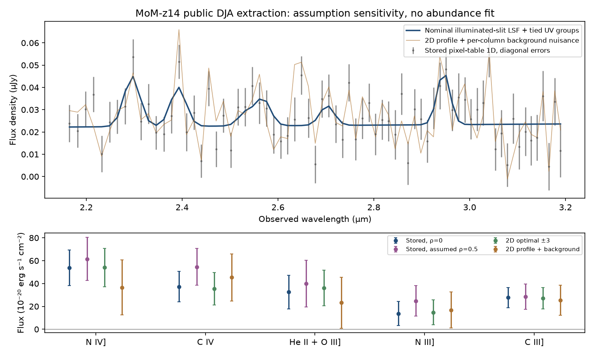

# JWST takeover: reproducible results and remaining scientific questions

9 October 2026. The starting revision was `8875fe1`, with the verified takeover
report authoritative over older claims. Eight specialists covered astrometry,
calibrated photometry, real-source validation, PSF/noise, spectroscopy,
enrichment, primary-source acquisition and adversarial review. Work proceeded
through image/acquisition, measurement, and follow-up discrimination rounds;
focused changes were tested and merged before downstream integration.

**Outcome:** this repository now executes the previously blocked real-image and
spectral experiments. It contains useful reproducible constraints on selection,
measurement systematics and conditional enrichment. It establishes no new galaxy,
abundance measurement, polluter identity or cosmological discovery.

## Observed images and candidate selection

Thirteen complete, current reprocessed original GOODS-S/SMACS i2d products were
provisioned and identity/hash verified: **1,555,571,520 bytes**, below the combined
1.5 GiB acquisition cap. These are individual exposures, not deep observation
mosaics, and are not byte-identical to historical pipeline products. Seven-image
and twelve-image manifests remain preserved alongside the matching thirteen-image
manifest. Raw FITS downloads are regenerated from bounded acquisition CLIs;
compact measurements, inventories and receipts are committed.

The first GOODS-S rerun produced **1,134 detections/proposals: 891 untestable,
236 valid screen failures and seven screen survivors**, over **0.962808 arcmin²**
of simultaneous valid pixel-center coverage. The screen uses F090W/F444W limits
and requires valid covered F200W photometry; it applies no F200W color criterion.
It is not a photometric-redshift selection, and its area is not an aperture-safe,
depth/completeness-weighted survey volume. The historical 1,732 rows remain
untestable rather than retrospectively identified as detector artifacts.

Released JADES positions give 23 unique covered F444W matches from 43 references,
median radial residual **0.02155 arcsec** and 90th percentile **0.10715 arcsec**.
The median offset is (-0.00905,-0.01503) arcsec. Ten-arcsec shifted controls leave
only one or two chance matches. This is a relative external-catalog check, not
an independent Gaia absolute astrometric certification. Current EXPMID values
correct the old F277W repeat baseline from 9.54 to **5.64853 hours**; F356W is
9.54657 hours.

Two acquired F444W sibling dithers supply a decisive follow-up: **only source 98
persists among the original seven**, with SNR 239.7/228.6/245.6. The other six have
no positive ≥3-sigma detection in covered comparisons (SNR -2.26 to 1.01).
A partially covered comparison of source 361 is explicitly untestable; its
fully covered comparison has SNR 0.17. All six flux discrepancies survive 3×
error inflation; source 336 becomes inconclusive at 10×. This rejects a stable
source at the original measured brightness, without assigning event identities.
Twenty-three JADES bright controls support repeat measurement stability: 22 are
persistent with one untestable in the first comparison, all 23 in the second.
Median sibling/original flux ratios are 1.0352 and 1.0071, with conditional
bootstrap intervals [1.0034,1.0656] and [0.9761,1.0258].

Conditional PSF/noise screening admits additional sources 254 and 46; both persist
in repeat images. They are separately selected hypotheses, not additions to the
original seven's survival denominator. None of 98/254/46 has a DR4 observation
match within 0.3 or 0.5 arcsec; nearest catalog distances are 13.515/24.761/10.880
arcsec and are not associations. Multi-band continuum diagnostics are available,
but no validated SED redshift or stellar/galaxy identity is assigned.

SMACS exposed an accessible acquisition and selection problem. The initial
F090W NRCA1 and F200W NRCA4 images occupy disjoint quarters: all 1,267 proposals
were untestable, with zero simultaneous area. A verified F200W NRCA1 product
resolves the acquisition gap. The selector now ranks simultaneous valid WCS
coverage rather than greedy independent overlaps; a counterexample test protects
the fix. Automatic selection with both F200 options gives **940 untestable,
317 valid failures and ten uncorrected screen survivors**, over **1.064573
arcmin²**. These raw SMACS survivors have not received matched PSF/noise/repeat
certification and cannot supply population counts.

## Measurement systematics and real recovery

On actual GOODS-S blank apertures, robust sky-scatter/diagonal-error factors are:

| Band | Factor | Conditional spatial-block 95% interval |
|---|---:|---|
| F090W | 1.5763 | 1.3281–1.8043 |
| F200W | 1.4515 | 1.1923–1.6248 |
| F444W | 1.0476 | 0.9647–1.1535 |

These combine covariance, confusion and residual backgrounds; they do not isolate
universal drizzle factors or calibrate Gaussian tails. Mask choices give ranges
1.398–1.576, 1.413–1.471 and 1.048–1.060. F444W ordinary normalized scatter is
1.481, substantially wider than its robust core estimate. Source Poisson errors
must not be indiscriminately multiplied by a sky-derived factor.

Pinned modeled PSFs, integrated through the actual native operator, give median
unresolved-source total/aperture multipliers **1.21713/1.20703/1.42867** for
F090W/F200W/F444W. Differential aperture-minus-total colors are -0.17335 and
-0.18270 mag for F090−F444 and F200−F444. Mask positions and centering matter:
92.3% area coverage can still yield a 1.71986 F444W multiplier. These are
finite-template, point-source predictions, not empirical extended-galaxy totals.
Production transfer controls and an independent actual-WCS operator comparison
agree to numerical precision.

An additional observed M92 curve-of-growth check retains eleven bright stars
passing isolation, coverage, saturation and two-dither gates. With neighbor-masked
far-background subtraction, their median 0.1887/0.8-arcsec finite-reference ratio
is **0.78396**, conditional source-group bootstrap 95% interval **0.75448–0.80694**.
The modeled finite-reference comparison, **0.76316**, lies inside this interval.
Unmasked background instead gives 0.99264, and catalog rather than recentered
positions lose about 5% in the small aperture. This crowded-field experiment
therefore constrains observed sensitivity, not absolute encircled energy or a
universal GOODS correction.

Applying median sky factors to the frozen GOODS-S measurements leaves six screen
survivors instead of seven; point-source corrections plus noise leave seven,
with source 254 entering and source 336 leaving. Point-source corrections alone
leave eight, including source 46. These selection changes quantify nuisance
sensitivity; neither result supplies a calibrated completeness or contamination
probability.

The M92 real-star experiment acquired **534,424,320 bytes** below its 600 MiB cap.
Independent DOLPHOT type/sharpness/crowding/SNR/flag cuts select 27,016 quality
references from 984,423 catalog rows. In two F444W dithers, detection is
8,733/13,131 and 8,744/13,157 among covered unambiguous references. Conditional
classifier rejection is 3/8,733 and 3/8,744: about **0.034%**, nominal Wilson
95% upper bounds about **0.101%**. Full-chain acceptance is only **66.48% and
66.44%**. For Vega magnitudes 20–22 detection is about 26%; at 22–24 it is zero
in this single-exposure test. All six catalog-matched rejected identities pass
the other dither; association/event ambiguities remain.

These are the same stars in one held-out field/visit, not two independent field
validations. Missing legacy training provenance prevents certifying complete
independence. Bright-star retention does not establish faint-galaxy recovery.
Grouped JADES DR4 observations retain 243/1,461/48 rows as 226/1,440/41 conservative
sky groups in robust high-z/low-z/separate-C cohorts. In the original GOODS image,
11 of 22 covered references are detected and accepted, all low-z; three covered
high-z controls are missed. Targeted deeper public F444W images recover **two of
those three**, with empirical-aperture SNR 15.53 and 14.11. The third has aperture
SNR 12.36 but fails segmentation. Deep images include original exposures and
are dependent. Three selected controls cannot estimate completeness.

Independent noise oracles also reject the assumption that covariance must always
inflate errors: exact aperture variance gives factors 1.000 for white noise,
2.291 for positive neighbor covariance and 0.379 for negative covariance.
Eighteen seeded trials test the numerical estimator; bootstrap coverage in six
trials is not a validated 95% coverage guarantee for observed sky.

## MoM-z14: observations, instrumental assumptions and chemistry

The public source-identity-verified MoM product has 473 wavelength bins and
31×473 SCI/WHT/PROFILE/BACKGROUND arrays. A fixed UV fitting window retains 73
usable bins. The processed product lacks native DQ and the original PIXTAB.
Exact upstream code confirms SCI and variance are already pathloss corrected
and SCI is nod differenced: a second path correction or sky subtraction is wrong.
Alternative optimal/boxcar/background-nuisance extractions preserve masks,
bin edges, signed amplitudes and propagated linear covariance.

Nominal illuminated-slit resolution R≈61–98 and a pinned generic UNITE point-source
curve R≈122–182 are compared using bin-integrated Gaussian templates, five joint
UV groups, continuum covariance and explicit assumed AR(1) scenarios. The point
curve is not an empirically calibrated LSF for this exact source. At published
z=14.44, width zero, stored extraction and diagonal covariance:

| Group | Nominal slit flux ± sigma | Generic point-source flux ± sigma |
|---|---:|---:|
| N IV] | 53.78 ± 15.66 | 40.40 ± 10.82 |
| C IV | 37.29 ± 13.32 | 31.59 ± 9.31 |
| He II + O III] | 32.58 ± 14.70 | 23.25 ± 12.21 |
| N III] | 13.76 ± 10.43 | 14.41 ± 8.32 |
| C III] | 27.68 ± 8.93 | 20.61 ± 6.88 |

Flux units are 10^-20 erg s^-1 cm^-2. Errors are conditional formal GLS standard
errors, not calibrated independent detection significances. The summed nitrogen/
carbon **line-flux** ratio is **1.039 [0.448,2.159]** at nominal resolution and
**1.050 [0.502,2.047]** at generic point resolution (conditional 95% Fieller sets).
Assumed extraction/background scenarios can admit zero nitrogen-line flux.
Changing instrumental treatment materially changes individual fluxes, whereas
intrinsic widths 0–650 km/s remain unresolved. Assumed covariance is not measured
covariance; rho=0.5 worsens nominal residual chi² from 89.99/66 to 186.30/66.
A tied-line redshift scan is consistent with z=14.44 but does not replace the
published posterior or create a new redshift discovery.

This figure retains the nominal illuminated-slit treatment. The point-source
comparison, masks and full flux covariance are in the separate pinned reports.

All 73 single-bin omission fits expose leverage. Removing a CIV-sensitive bin at
2.393414 µm reduces CIV to about 5.1±27.7; this signals undersampling sensitivity,
not evidence that the pixel is bad. **All nine original native CAL exposures**
are now acquired and checksum verified (**464,135,040 bytes**, below 600 MiB).
Source identity agrees. Fatal-DQ/error checks find the inspected whole-slit UV
windows and highest-leverage wavelength overlaps usable. Whole-slit checks do
not establish trace-weighted coadd quality or an independent line confirmation.

Published Cue [N/C]=0.90 (+0.29,-0.63) and the stronger separate ionic analysis
remain explicitly distinct model-dependent literature inferences. Writing the
observed summed flux ratio as Q×elemental N/C shows the missing identifiability:
Q includes emissivities and ion fractions, which are not calibrated here.
The Cue median requires Q=0.521 with conditional 95% set 0.225–1.082 under nominal
resolution; point resolution gives Q=0.526 and 0.251–1.026. Q=1,0.5,0.2 yield
conditional abundance points about 0.617,0.918,1.316 dex from the same nominal
fit. Resolution changes the central Q by about 1%, without selecting a polluter.

## Competing enrichment and formation explanations

Primary numerical yields are versioned rather than invented. Four specific
0.1-solar-metallicity SMS models give pure-ejecta [N/C] 0.767/2.155/2.206/1.693
for initial masses 1,000/10,000/50,000/100,000 solar masses. With equal element
retention and lower-N/C ambient material, the 1,000 model cannot reach the Cue
median; this conditional convex-mixture limit is not a flux-based population
exclusion while Q remains uncalibrated. Joint O/H+C/O endpoint cases, helium
predictions and gas-parcel budgets provide sharper future tests than N/C alone.

At fixed median target and specified ambient composition, one fully retained
10,000/50,000/100,000 event can pollute at most about 3e4–1.5e6 solar masses of gas.
Ten-percent equal retention lowers every bound by ten. Gas mass, retention and
ambient C/O are unmeasured, so these cannot become galaxy-wide event counts.
Conditional carbon-poor, full-retention median-target He/H predictions are
**0.08382/0.08577/0.09329** for those three yields, versus assumed ambient
0.08333. The 50,000 model at a separate 1.70-dex target predicts 0.10001.
Stellar/nebular He II and ionization must be separated before testing them.

Selected rotating massive/Pop III models overlap portions of the broad published
abundance interval. All comparisons use MoM's solar log(N/C)=-0.60; one paper's
+0.28 is +0.25 on this convention and lies just outside the quoted endpoint box,
while +0.76 becomes +0.73. Rounded marginal endpoint membership is not statistical
model rejection. Pristine dilution changes O/H but preserves N/C,N/O,C/O,
providing a direct discriminator. A prompt VMS nitrogen benchmark lacks matching
C/O yields and cannot support a manufactured joint likelihood.

Under assumed Planck18 cosmology the cosmic age at z=14.44 is **283.071 Myr**;
redshift endpoints alone give 282.520–283.624 Myr. Time since assumed onset z=20
is **104.959 Myr**. A published GN-z11 204-Myr dual-burst history cannot fit that
onset at MoM-z14: it exceeds the budget by **99.041 Myr**, and requires onset
z≥34.960 for timing alone. A 103-Myr version fits with 1.959 Myr to spare.
This rejects the long history/onset combination, not WR enrichment generally.
A recent luminous burst does not date every stellar generation.

Conditional on published median stellar mass 10^8.1 solar masses, baryon accounting
requires halo mass ≥7.96e8 solar masses at complete conversion, or ≥7.96e9 at
10% conversion. These are accounting bounds, not halo measurements. Bursty star
formation, mass-to-light ratios/IMF, duty cycle, conversion efficiency and local
pollution supply testable conventional explanations. The selected objects lack
a measured survey selection function, halo abundance likelihood and cosmic
variance estimate; modified dark matter or black-hole cosmology cannot be ranked.
A black-hole ionizing-source test needs resolved high-ionization line ratios,
broad components and spatial/extraction controls, none uniquely supplied by nitrogen.

## Genuine remaining dependencies and best next experiments

1. **Source-specific spectral reduction and covariance:** reconstruct native nod
   extractions with exact contributor weights, source geometry/illumination,
   wavelength calibration, pathloss and off-source background controls. Archive
   access is resolved; original coadd PIXTAB/weights and reproducible upstream
   settings remain unavailable. A documented independent reduction can proceed
   from the nine acquired exposures but must not silently claim the old extraction.
2. **Atomic/photoionization forward models:** acquire a versioned emissivity grid
   spanning temperature, density and ionization, including all measured N/C/O
   groups. Fit covariant line fluxes jointly; report abundance uncertainty across
   grids before assigning enrichment likelihoods. Higher-resolution spectroscopy
   separating He II/O III] and N/C density multiplets is an external observing need.
3. **Selection and SED calibration:** deep multi-band image modeling, extended-source
   PSFs, empirical noise tails and real-source injections across independent visits.
   Vet the remaining conditional GOODS and raw SMACS proposals with independent
   images/spectroscopy. Do not turn the current screen area into survey volume.
4. **Mechanism discriminators:** constrain C/O, ionized gas mass, helium and differential
   element retention. Test joint yields and full formation durations; compare halo/
   luminosity-function predictions only on a completeness-controlled population.
5. **Classifier evidence:** recover training source/visit/generator provenance and
   expand observed-star/galaxy tests to independent fields, actual faint brightness
   and crowding. Bright-star acceptance alone cannot certify science completeness.

## Reproduce and audit

Use Python3.12 and `requirements-research.lock`; run `scripts/quality_gate.py`.
The artifact index in `TAKEOVER_STATUS.md` links each executed report, compact
result and exact CLI. Acquisition inventories pin URLs, product identity, byte
caps and hashes. Cache and new-download guards reject self-consistent altered
receipts that conflict with pinned inputs. Native completeness checks reject
empty/partial/duplicate exposure inventories rather than certifying vacuous success.
Large raw/full-trial arrays are outside git with documented regeneration and hashes.
Historical results are retained; refined selections have separate denominators.

Final integrated checks and PR links are recorded in the current status document.
Synthetic unit controls, real observations, conditional assumptions and unmeasured
external requirements remain explicitly separated.
