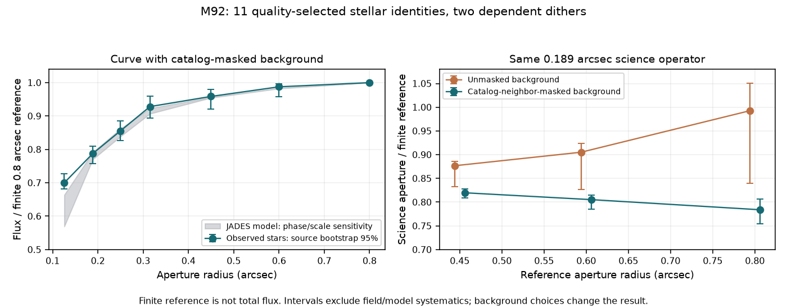

# Observed M92 aperture response, 9 October 2026

Eleven independently catalogued, quality-selected bright stars were measured in
both held-out M92 F444W dithers. This is an observed-star finite-aperture test,
not an injection result or a measurement of true total stellar flux. The two
images share a visit, and each star is one source group rather than two
independent objects. Their EXPMID separation is 19.8634 minutes. No source was selected using the frozen classifier or by
agreement with a desired aperture correction.

## Selection and operator

The hash-verified JWSTSTARS DOLPHOT/Gaia-tied catalog contains 984,423 entries.
The fixed cuts are type 1, reference SNR >=100, 15<=F444W Vega<19, absolute
sharpness <=0.1, crowding 0–0.05 mag, quality flag 0 and positive valid error.
This yields 6,166 references, with 2,975 covered in both detector images.
Neighbors are drawn from all catalog entries with valid F444W photometry and
SNR >=3. Requiring their summed catalog flux inside 0.8 arcsec to be <3% of
the target yields **56 candidates**. Undetected/fainter neighbors are not
thereby certified absent.

All 56 are attempted under additional fixed image gates, retaining **11** in
both images. Rejections are 13 masked/saturated cores, 20 insufficient reference
background coverage, 7 ambiguous centroids, 2 incomplete reference apertures and
3 insufficient reference SNR. The reference apertures must be >=99% covered,
the 0.3 arcsec core must be fully valid, and the reference SNR must be >=30.
DO_NOT_USE and SATURATED bits are masked; a corrected JUMP_DET flag alone does
not invalidate a pixel. The maximum cap is 24 and was not reached. Selected
reference magnitudes span 17.169–18.929.

The science aperture is **0.18873807945080867 arcsec**, with its original
**0.37747615890161734–0.6291269315026955 arcsec** mean-SCI background annulus.
Spherical FITS TAN-SIP geometry and actual corner-integrated pixel solid angle
convert MJy/sr to Jy. Catalog identities are retained, but the images are
independently centroided: the release and current calibration versions differ.
Centroid displacement is bounded at 0.2 arcsec and two core-radius centroid
estimates must agree within 0.15 pixel.

Larger finite reference apertures are 0.45, 0.6 and 0.8 arcsec. Their background
annuli are 0.95–1.35 or 1.1–1.5 arcsec. The alternate catalog-neighbor masks have
radius 0.22 arcsec and affect background pixels only. At least 50% of a masked
reference annulus must remain. These are contamination controls, not proof of
source-free backgrounds. Ratio error propagation includes shared aperture and
annulus pixels through explicit covariance; interpixel detector correlations
and calibration errors remain excluded.

**22 production transfer checks** agree in calibrated science flux and diagonal
sigma; maximum flux residual is 3.39e-21 Jy and sigma-ratio residual 2.22e-16.

## Conditional finite-aperture results

The table uses a catalog-neighbor-masked 0.95–1.35 arcsec reference background.
Each star's two dither ratios are averaged before computing the median and
source-group bootstrap interval. The interval omits field-wide systematic error.

| Finite reference radius | Science/reference ratio | Conditional source bootstrap 95% | Robust scatter of dither differences |
| --- | ---: | --- | ---: |
| 0.45 arcsec | 0.81972 | 0.80863–0.82829 | 0.00369 |
| 0.60 arcsec | 0.80528 | 0.78542–0.81497 | 0.00374 |
| 0.80 arcsec | 0.78396 | 0.75448–0.80694 | 0.00946 |

Changing the masked background to 1.1–1.5 arcsec gives ratios 0.82166, 0.80869
and 0.77929. Unmasked 0.95–1.35 arcsec background gives **0.87671, 0.90521 and
0.99264**. In this crowded field, background contamination can over-subtract
the larger reference and drive the apparent science/reference ratio toward
one. A flat growth curve in that configuration does not establish that the
small aperture captures the total flux.

Forced catalog centres recover a median **0.94996** of the independently
centred science-aperture flux (16–84%: 0.93673–0.96808). A roughly 5% median
centering loss matters at these radii. This is conditional on the current
catalog/image combination, not a general astrometric error budget.

## Comparison with the modeled PSF

The verified JADES F444W modeled template gives a science/finite-0.8 ratio
**0.76316** on the 0.063 arcsec grid with the same named radii. That value is
inside the observed masked-background conditional interval. Comparing the
observed **0.78396** directly with a model's total-flux response near **0.6975**
would be invalid: the former denominator is finite, while the latter uses the
whole supplied template.

A common masked reference-background curve is normalized at 0.8 arcsec. Model
sensitivity samples nine pixel phases and three actual observed local pixel-area
scales: 0.0622805, 0.0633784 and 0.0638957 arcsec/pixel.

| Radius | Observed median finite curve | Conditional source bootstrap 95% | Modeled phase/scale sensitivity |
| --- | ---: | --- | --- |
| 0.125825 arcsec | 0.70009 | 0.68121–0.72645 | 0.56914–0.66379 |
| 0.188738 arcsec | 0.78761 | 0.75825–0.81020 | 0.77004–0.79143 |
| 0.250 arcsec | 0.85563 | 0.82715–0.88502 | 0.83875–0.86189 |
| 0.315 arcsec | 0.92825 | 0.89373–0.95896 | 0.90694–0.92312 |
| 0.450 arcsec | 0.95872 | 0.92121–0.97966 | 0.95459–0.95635 |
| 0.600 arcsec | 0.98747 | 0.95822–0.99649 | 0.98219–0.98384 |

The measured smallest-aperture cores are more concentrated than this sampled
modeled comparator. M92 native `cal` images and a JADES modeled mosaic differ
in resampling, field, visit, stellar SED, PSF orientation and centering. The
sampled model sensitivity is not an exhaustive uncertainty bound, and the
source bootstrap is not a calibration confidence interval. These data support
conditional compatibility at the 0.189 arcsec science radius, while giving no
basis for a universal correction at every radius or for extended galaxies.



## Reproduce

Use the already pinned acquisition recipe described in
[real-source validation](REAL_SOURCE_VALIDATION.md), then:

```bash
python -m discovery.stellar_aperture /tmp/m92 \
  --psf-directory data_sources/pilot \
  --full-output /tmp/m92-aperture-full.json \
  --plot research_output/visuals/m92_aperture_response.png
python -m pytest runner/tests/test_stellar_aperture.py \
  runner/tests/test_native_psf.py runner/tests/test_psf_noise.py
```

The compact report is `research_output/m92_aperture_response.json`. It retains
input receipts/hashes, every selected identity and candidate gate failure,
operator checks, bootstrap seed-derived summaries, model provenance and the
canonical hash of regenerable per-star records. Large source images, raw
catalog and full trial records stay outside git. Tests use independent Gaussian,
known-covariance, physical-unit, DQ, background-mask and grouped-repeat controls;
they are distinct from the reported actual-star measurements.

JWSTSTARS DOI: **10.17909/cn6n-xg90**, CC BY 4.0, with attribution to the
[JWSTSTARS release team](https://archive.stsci.edu/hlsp/jwststars). The images use
CAL_VER 2.0.1 / CRDS jwst_1535.pmap, whereas the catalog used older reductions.
The [STScI PSF documentation](https://jwst-docs.stsci.edu/jwst-near-infrared-camera/nircam-performance/nircam-point-spread-functions)
explicitly distinguishes individual-exposure and resampled PSFs.

The next calibration should use observed isolated stars in the exact GOODS-S
product/grid or a similarly resampled held-out field, jointly modeling neighbors,
background and the extended-galaxy light profile. Enlarging an aperture or
borrowing a correction from a different product cannot settle those terms.
