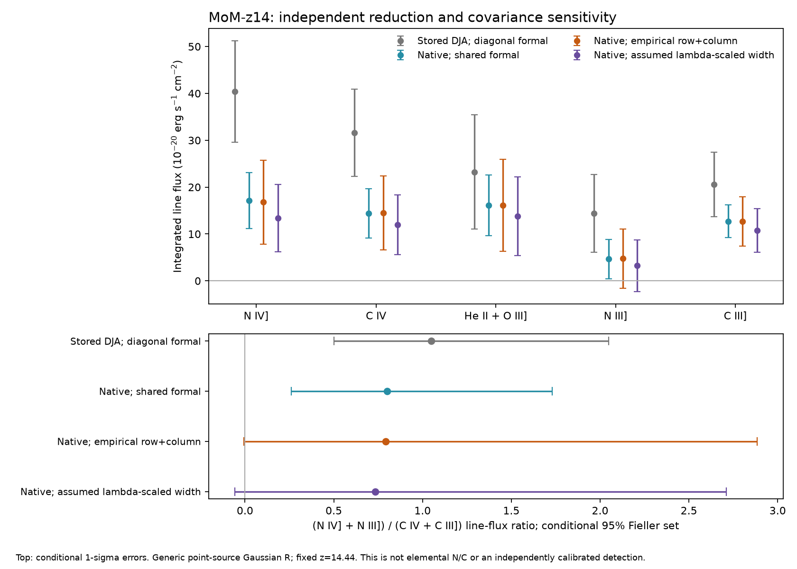

# MoM-z14: spatial covariance and source-profile follow-up

This builds on the frozen [independent native reduction](MOM_NATIVE_REDUCTION.md),
replaying its four fits and re-extracting the actual nine pinned CAL products
before extending the covariance model. The first report remains unchanged.
The new source covariance is still a conditional transport model, not a
calibrated posterior or measured spectral LSF.

The first reduction merged in [PR36](https://github.com/Patto1155/JWST_scnience_env_2/pull/36)
as `06273801`; this follow-up was rebased onto merged master `d8753830` before
the final actual-data rerun. The first JSON/NPZ remain unchanged. The new optional
spatial-correlation API adds only an explicit false metadata flag when rerunning
the original method; its original four numerical fits still replay identically.

## The new experiment

The first experiment measured spatial lag correlations but did not propagate
them. This follow-up constructs a stationary row kernel from those moments,
then propagates it through each signed source extraction operator and the
verified shared-nod mixing matrix. Every recovered raw-noise component and
positive diagonal reconciliation remainder receives the same explicit row
kernel hypothesis. The measured spectral kernel and noise amplitude are retained.
The row/column transport is separable; source-dependent/nonstationary background
and common inter-group reference terms are still missing.

Spatial lag 1/2/3 correlations are −0.01038/0.09086/0.10947 from
1,485/819/189 overlapping pixel pairs. Only a few off-source spatial placements
exist in each 28-row slit; these are not independent apertures. A Bartlett taper
has minimum eigenvalue 0.88098 and needs no PSD shrinkage. Deliberately untapered
lags and leave-one-control-group-out moments are separately tested. The source
data in all three groups stay fixed during the latter control sensitivity.

The source-amplitude sigma multiplier from spatial correlation alone is
**0.99577 median**, range **0.98666–1.00352** over source columns/exposures. The
signed source/ghost/background operators can turn positive pixel correlation
into a smaller extracted variance; covariance need not inflate every error.
This range describes these operators and moment model, not a calibration interval.

## Result

Generic point R, fixed z=14.44 and width zero, with empirical spatial plus
spectral transport, gives:

| UV group | Flux ± conditional sigma (10⁻²⁰ erg s⁻¹ cm⁻²) |
|---|---:|
| N IV] | 16.78±8.93 |
| C IV | 14.49±7.85 |
| He II+O III] | 16.12±9.79 |
| N III] | 4.74±6.33 |
| C III] | 12.64±5.27 |

The summed nitrogen/carbon **line-flux** ratio is **0.79306**, conditional 95%
Fieller set **[−0.00598,2.88356]**. Nominal R gives
**0.82664 [0.00952,2.93566]**. This preserves the first experiment's weak,
model-dependent nitrogen support; it does not measure elemental N/C.

Leaving out one control group moves the lag-3 moment from 0.0120 to 0.1998,
illustrating sparse moment uncertainty. The resulting all-source-group ratio
ranges only **0.79228–0.79396** under the specified stationary kernel family.
Untapered moments give **0.79668 [0.00014,2.86657]**. A positive lower endpoint
that tiny is nuisance-sensitive and is not independent detection evidence.
Small changes in these tested kernels do not certify unknown covariance tails,
source contamination or all plausible spatial models.

The red-continuum spatial width had been transported to the UV as a constant
0.8 native pixels. A separate, deliberately simple diffraction sensitivity,
`sigma(lambda)=0.8 × lambda/3.9`, gives N IV] **13.42±7.19** and ratio
**0.73336 [−0.05831,2.71072]**. This assumed scaling lowers the UV width and
changes flux normalization; it is not a measurement of galaxy extent. The
red-continuum geometry and source-position pathloss do not determine illumination
along the dispersion direction or calibrate a spectral LSF.

A further actual source-operator control uses **28 native columns at 1.15–1.70 µm**,
below the Lyman break conditional on published z=14.44. With the same signed
source geometry and shared/spatial formal covariance, the normalized mean is
−0.1571 and RMS **1.2610**; variance about its mean is **1.6234**. No column is
above +3 or below −3 formal sigma. The mean is −0.000608 µJy with a
diagonal-column formal error 0.000675 µJy; column correlation is omitted from
that descriptive mean error. Transporting the UV variance amplitude gives RMS
**0.8462**. This supports checking sky and source operators separately, without
proving spectral stationarity or calibrating tails from 28 samples. The zero-
source expectation assumes IGM absorption; foreground/residual light is allowed.



The figure compares actual stored-coadd and independent-native fits under the
generic point Gaussian R. Top bars are conditional one-sigma GLS errors; the
bottom uses conditional 95% Fieller sets. Reduction and covariance differences
are not an elemental abundance measurement or proof that one extraction is true.

## Reproduce and validate

```bash
python -m tools.jwst.native_spatial_covariance \
  --native-dir /tmp/mom-native \
  --baseline-report research_output/mom_native_reduction.json \
  --output research_output/mom_native_spatial_covariance.json
python -m pytest tests/test_mom_native_reduction.py \
  tests/test_mom_native_spatial_covariance.py
```

The report pins the frozen input report, compact replay and figure comparison.
It refuses a native extraction or shared formal covariance inconsistent with
the frozen compact arrays. Original acquisition and hashes are unchanged.
Six additional independent oracles check 90,000 correlated raw-field draws,
identity-kernel equivalence, increasing/decreasing variance counterexamples,
explicit PSD shrinkage for noisy moments and failure when control pairs are
absent, and below-break source-operator empty-ensemble rejection. Thirteen
native/spatial oracle tests pass.

Accessible next work is off-source validation over other slits/visits with
independent geometry and brightness-controlled source injections through the
actual detector/reference pipeline. A source-specific wavelength/dispersion
calibrator and original
author PIXTAB/optimized settings remain external dependencies. Empirical
moments from the same few slit rows cannot resolve every source-noise component.
