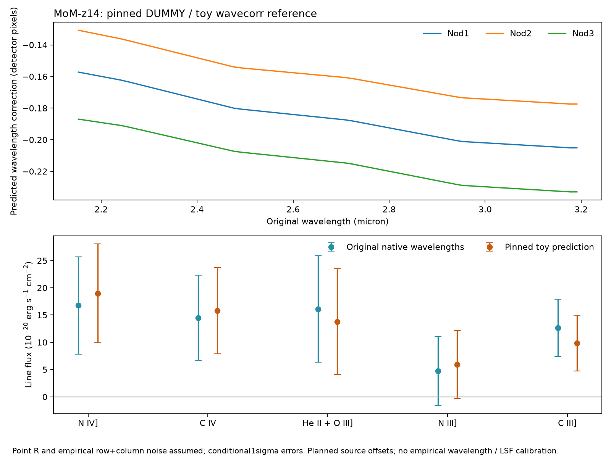

# MoM-z14: the pinned wavelength zero-point prediction

This round evaluates a point-source wavelength correction omitted under the
native EXTENDED classification as an explicit point-source hypothesis for the
nine official CAL slits. It extends the merged
[native reduction](MOM_NATIVE_REDUCTION.md) and
[spatial covariance transport](MOM_NATIVE_SPATIAL_COVARIANCE.md), preserving
their original artifacts. The actual reference is **DUMMY** pedigree, described
as a MOS correction computed using a simple toy model. Its prediction is a
versioned instrumental sensitivity, not empirical wavelength or spectral LSF
calibration, a new line detection, or an elemental abundance.

## Calibration and units audited

Every target SCI slit has `WAVECOR=False` and its original GWCS has no
`wavecorr_frame`. The primary `S_WAVCOR=COMPLETE` refers to a multisource exposure
and cannot establish that this EXTENDED target was corrected. All nine original
CAL hashes and sizes are checked before analysis. The WCS reproduces the stored
28×423 WAVELENGTH arrays with the identical finite-pixel mask and maximum
difference below 2.385×10⁻⁷ µm, consistent with float32 wavelength storage.

Each original pins `crds://jwst_nirspec_wavecorr_0004.asdf` under
`jwst_1535.pmap` and calibration 2.0.1. The
[reference and acquisition receipt](../data_sources/followup/mom_wavecorr_receipt.json)
record the 16,453-byte SHA256-pinned public CRDS file. It has the internal
filename `_0002.asdf`, author ESA, date 2016-03-30, and DUMMY metadata; this
discrepancy is retained rather than silently renamed. Only 16,453 new scientific
input bytes were acquired, bringing the prior unique scientific-input total to
470,104,487 bytes. Optional WCS software wheels and the inspected algorithm
source have separate receipts: 3,425,987 payload bytes including a superseded
ASDF wheel, below the 25 MiB new-input allowance even with 1 MiB conservative
metadata allowance. Restoration of the vanished earlier scratch environment
and nine already-pinned CALs is separately accounted by the parent recovery
receipt; these are repeated existing inputs.

The reference lookup axes are **wavelength in meters** (0.6–5.3 µm) and **source
offset as a fraction of MOS pitch** (−0.5 to +0.5); output is detector pixels.
The pinned stdatamodels5.0.2 schema distinguishes MOS pitch from fixed-slit
aperture width. Its width field is 1.0442×10⁻⁴ m in the model plane; it is not
multiplied into `SRCXPOS` a second time. Exact ASDF block offsets, byte orders,
strides and stored checksums matter: the pixel-offset table has Fortran strides,
and its coordinate arrays are views of a shared binary block. A deliberately
transposed table fails the independent axis oracle. The centered-source table
has nonzero entries, so forcing a zero correction at `SRCXPOS=0` is incorrect.

The narrow decoder accepts this one full-file hash and checks all three
uncompressed blocks and the block index; it does not execute arbitrary ASDF
tags. Its result agrees exactly with the actual ASDF/Astropy Tabular2D reader at
interior and extrapolated test points. The raw CAL reader uses separately
pinned ASDF/GWCS/stdatamodels packages, without changing the research environment.

The [pipeline2.0.1 algorithm](https://github.com/spacetelescope/jwst/blob/2.0.1/jwst/wavecorr/wavecorr.py)
computes original GWCS dispersion from λ(x+0.5,y)−λ(x−0.5,y), in meters/pixel.
Across-row mean wavelength and dispersion define a one-dimensional transform:

\[
\bar\lambda_{\mathrm{corr}}=
\bar\lambda+o(\bar\lambda,x_{\mathrm{source}})\bar D.
\]

That linear lookup transform is applied to each native 2D wavelength; science
pixels are not interpolated. The sign is addition. The implementation checks
meters, positive dispersion, source-coordinate bounds, native shape, monotonic
transform and prior correction state. Both the target FITS flag and WCS frames
guard against double application.

## Actual correction and likelihood comparison

The three nod source-coordinate values are −0.107, −0.093 and −0.121 MOS-pitch
fractions, repeated across the three groups. Across 2.15–3.20 µm their median
predicted shifts are respectively −0.1878, −0.1610 and −0.2151 detector pixels;
the complete UV range is −0.2330 to −0.1307 pixels. These are planned metadata
positions, not a measurement of actual placement within a shutter. The measured
red continuum cross-dispersion trace does not measure that dispersion-direction
position.

Source amplitudes, extraction/profile/pathloss, native masks and empirical
shared-noise covariance remain frozen. Six original wavelength fits reproduce
the earlier native and spatial reports, then six new fits use the predicted
wavelengths and recompute all line-template flux covariances. Both the templates
and the fν-to-integrated-flux conversion use the new wavelength grid. This is
not a full spec2 reprocessing: wavelength-dependent pathloss/calibration is not
regenerated. The point/nominal resolving-power curves, fixed z=14.44, zero
intrinsic width and legacy fixed multiplet weights, including N IV] 1486 only,
remain assumptions. Physical
atomic multiplet refits are a separate experiment.

For the point-resolution assumption with empirical row+column noise transport:

| Quantity | Original wavelengths | Pinned toy prediction |
|---|---:|---:|
| N IV] flux | 16.782±8.931 | 18.986±9.091 |
| C IV flux | 14.493±7.853 | 15.784±7.916 |
| He II+O III] flux | 16.116±9.789 | 13.809±9.710 |
| N III] flux | 4.738±6.327 | 5.951±6.226 |
| C III] flux | 12.643±5.266 | 9.838±5.117 |
| (N IV]+N III])/(C IV+C III]) line-flux ratio | 0.7931 | 0.9733 |
| Conditional 95% Fieller set | [−0.0060,2.8836] | [0.1218,3.8186] |
| Conditional χ²/623 | 547.399 | 548.428 |

Fluxes are in 10⁻²⁰ erg s⁻¹ cm⁻² with conditional 1σ errors; full signed vectors, conditional standard
errors and 5×5 covariances are in
[the numerical report](../research_output/mom_native_wavecorr.json).
The small +1.029 change in χ² does not favor the correction under this fixed
likelihood. The zero-crossing change in a conditional ratio interval depends on
a toy reference, planned positions and other unresolved assumptions; it cannot
establish a robust detection or nitrogen abundance.



## Uncertainty probes and limitations

Changing all source offsets coherently by ±0.05 MOS pitch gives line-flux ratios
0.8865–1.0283. The reference stores uniform variance values
0.010000000000000002, with no covariance. Although its schema calls these
variance, its prose says detector-pixel units without explicitly squared units.
Interpreting the values as pixel² only to define deterministic coherent ±0.1
pixel changes gives ratios 0.8793–1.0321. Neither probe is a calibrated posterior
error, confidence interval, or independent wavelength calibration. Reference
uncertainty is not added as independent noise at every pixel.

Replacing exact WCS half-pixel dispersion with integer-grid native differences
changes the point/spatial ratio by only 2.96×10⁻⁶ and each fitted flux by less
than 3×10⁻⁵ in flux units. This checks numerical dispersion transport for these
specific native data; it does not validate the toy optical reference.

No source-specific spectral LSF has been measured. A zero-point shift does not
calibrate its width, asymmetry, illumination, or wavelength dependence. The
source's actual position/extent along the dispersion direction remains
unmeasured. Persistent shared calibration errors, UV extraction-profile
transport, sparse off-trace covariance sampling and author coadd PIXTAB/weights
remain limitations described in the earlier reports. The new correction is
derived from the same observations, so it supplies no independent source or
line detection.

The following shortcuts are rejected by these checks: interpreting the primary
COMPLETE flag as a corrected target, subtracting backgrounds again, multiplying
the pitch into an already normalized coordinate, reversing the lookup axes or
correction sign, forcing a zero centered-source correction, and treating the
toy reference's variance as independent calibrated noise. They are validation
counterexamples, not observationally rejected astrophysical hypotheses.

## Reproduction and next experiments

Install the [optional reader lock](../data_sources/followup/mom_wavecorr_optional_requirements.txt)
into a separate target or environment. With those packages on `PYTHONPATH` and
the hash-verified official CALs cached locally:

```bash
python -m tools.jwst.native_wavecorr \
  --native-dir /path/to/pinned-nine-CALs \
  --output /tmp/mom-native-wavecorr.json
```

The tracked NPZ preserves original/corrected native grids, original-GWCS
dispersion derivatives, masks, trace, selected indices, derived amplitudes,
formal/spatial shared-noise blocks and spectral kernel. It contains no raw SCI
pixels. To reproduce twelve numerical fits and the wavelength mapping without
optional reader packages or raw CALs:

```bash
python -m tools.jwst.native_wavecorr \
  --replay-report research_output/mom_native_wavecorr.json \
  --output /tmp/mom-wavecorr-replay.json
```

This compact replay validates numerical transport, not an independent WCS/raw
pixel reduction. `load_wavecorr_replay(...,corrected=True/False)` exposes both
wavelength hypotheses with the identical source/noise likelihood for a clearly
composed downstream physical-multiplet experiment.

Seven offline oracles cover reference strides/axes, an independent Astropy
table, units, sign, coherent column transformation, NaN preservation,
noninvertibility, corruption, prior-correction rejection and a compact loader
that exposes no fabricated SCI pixels.
Earlier native/spatial oracles remain unchanged and pass.

Priorities are: measure actual MOS placement from confirmation/target-acquisition
information; compare pinned physical multiplet templates on both wavelength
hypotheses with a fresh covariance fit; obtain an empirical wavelength/LSF
calibrator or justified versioned optical model; and regenerate the point-source
spec2/pathloss/extraction consistently. These require measured geometry or
calibration inputs before a stronger abundance interpretation is defensible.

Primary calibration sources:

- [wavecorr description](https://jwst-pipeline.readthedocs.io/en/stable/jwst/wavecorr/description.html)
- [reference format](https://jwst-pipeline.readthedocs.io/en/stable/jwst/wavecorr/reference_files.html)
- [pinned stdatamodels schema](https://github.com/spacetelescope/stdatamodels/blob/5.0.2/src/stdatamodels/jwst/datamodels/schemas/wavecorr.schema.yaml)
- [NIRSpec calibration concept](https://jwst-docs.stsci.edu/jwst-calibration-status/nirspec-calibration-status/nirspec-calibration-concept)
- [MOS placement caveats](https://jwst-docs.stsci.edu/known-issues/nirspec-known-issues/nirspec-mos-known-issues)
