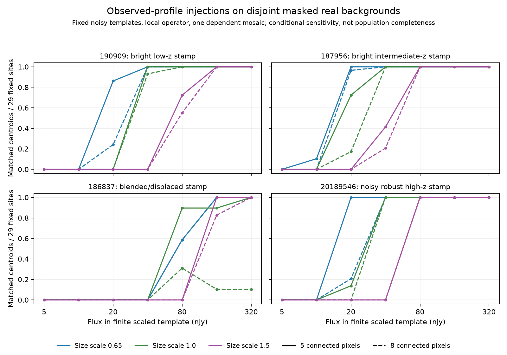

# Observed-profile injections into actual mosaic backgrounds

9 October 2026. This second real-source round builds on merged PR #32
(`e4bcfd4`) and preserves its frozen-control artifacts. It executes **2,436
synthetic insertions** into actual verified background pixels, with **4,872
centroid-matched detector evaluations**. No new images were downloaded.

The principal result is that flux, extent, deblending and matching together
control recovery. More inserted flux need not increase centroid recovery for a
blended profile. These curves are conditional operator sensitivity, **not the
completeness of a real faint-galaxy population**.

## Frozen design and input dependence

Before evaluating insertions, `observed_template_injections freeze` fixes four
observed stamp identities, seven finite-stamp fluxes (5–320 nJy), three size
scales (0.65, 1, 1.5), and 29 background positions. The complete plan, input
hashes, profile hashes, source labels, masks and numerical sky thresholds are
tracked in `research_output/observed_template_injection_plan.json`. Execution
reconstructs and verifies that exact plan before running any trial.

Templates are the previously observed bright low-z control `190909`, bright
intermediate-z control `187956`, segmentation-sensitive low-z control `186837`,
and robust high-z seed `20189546`. This deliberate choice uses the preceding
round; it is not a blind population sample. Each stamp subtracts a scalar
0.7–1.0-arcsec local background, truncates at 0.45 arcsec and clips negative
pixels. Both radial sky-annulus bounds are enforced: enclosing-square corners
outside 1.0 arcsec are excluded and covered by an explicit regression. Profiles
are linearly resampled and renormalized so inserted **finite
stamp flux** is preserved. Sizes do not represent physical redshift evolution
or a source-specific PSF model.

The stamps retain a fixed observed noise realization and possible neighbour
flux. Negative-to-positive flux clipping fractions are 0, 0, **0.00252** and
**0.02374**, respectively. Their formal 0.2-arcsec aperture SNR values are
1423.9, 3232.8, 29.63 and 22.14. These are formal input diagnostics, not calibrated
source significances. The `186837` stamp has a **0.246-arcsec** finite-profile
centroid offset from its stamp centre, exceeding the 0.2-arcsec association gate;
it deliberately retains observed blending/asymmetry rather than asserting an
isolated true source profile.

Background positions come from a fixed grid and seeded ordering. A positive
two-sigma source mask, dilated four pixels, excludes source cores from the
largest inserted footprint. Entire 49×49-pixel trial stamps are valid and
globally disjoint, including across overlapping cutouts. Sites comprise
10/10/9 stamps in the three verified cutouts and 19 spatial blocks. Source
masking censors positive tails; these sites do not represent arbitrary crowded
or unmasked sky. All cutouts still share one dependent mosaic and original
contributors, as quantified in `DEEP_CONTROL_RECOVERY.md`.

The detector uses local segmentation/deblending within each 49-pixel stamp at
the **fixed full-image uninjected median and five-sigma threshold**. It does
not re-estimate a more favorable threshold after adding signal. Five- and
eight-connected-pixel variants use the same injected pixels and association
radius. The latter matches original minimum connected angular area only;
noise and PSF are not thereby matched. Cropping can change segments connected
outside the stamp, so this is a declared bounded operator, not a silent claim
of equivalence to the original full-field pipeline.

No fresh source-Poisson realization is added, stored background covariance is
retained, and no native-grid classifier or color/SED selector is applied. Each
template/size/flux curve reuses the same 29 sites; 2,436 insertions are not 2,436
independent backgrounds, galaxies or visits.

## Executed results

All **58 null site/operator controls** have no matched centroid. This checks
the declared masked design; it does not estimate an unmasked false-positive rate.
The eight-pixel operator loses **149 paired matches** relative to five pixels,
and gains none in this design.

| Observed stamp / size / finite flux | Five-pixel matches | Eight-pixel matches |
|---|---:|---:|
| `190909`, size 1, 40 nJy | 29/29 | 27/29 |
| `190909`, size 1.5, 40 nJy | 0/29 | 0/29 |
| `190909`, size 1.5, 80 nJy | 21/29 | 16/29 |
| `187956`, size 1, 20 nJy | 21/29 | 5/29 |
| `20189546`, size 0.65, 20 nJy | 29/29 | 6/29 |
| `20189546`, size 1, 20 nJy | 4/29 | 0/29 |
| `20189546`, size 1, 40 nJy | 29/29 | 29/29 |
| `186837`, size 1, 80 nJy | 26/29 | 9/29 |
| `186837`, size 1, 160 nJy | 26/29 | 3/29 |

For the blended `186837` template, doubling 80 to 160 nJy under eight pixels
causes **seven paired site losses and one gain**. Aggregate recovery falls
9/29 to 3/29. The operator can therefore violate an assumed monotone flux-only
recovery curve. This is a centroid/deblending counterexample under a fixed noisy
blended stamp, not evidence that physical galaxies become intrinsically less
detectable when brighter. Under five pixels, the same transition has one loss
and one gain, hidden by its unchanged aggregate count of 26.



The 84 curves retain counts, paired operator differences and conditional
spatial-block resampling intervals. For `190909` at size 1.5 and 80 nJy, the
five-pixel fraction **0.724** has conditional interval **0.569–0.905**; the
eight-pixel fraction **0.552** has interval **0.343–0.800**. These 500-resample
intervals describe variation within the selected background design. They have
no calibrated 95% coverage guarantee and omit template noise uncertainty,
masking, field/visit variation, source Poisson, calibration and PSF systematics.
Degenerate intervals at zero or one do not bound unseen failures. The intervals
must not be used as population-completeness confidence bounds.

## Reproduce and validate

Use the pinned original image and three cached DAWN cutouts documented in
`FOLLOWUP_DATA.md`. `$DEEP` is their directory; `$ORIGINAL` is the verified
`jw01180026001_09201_00003_nrcalong_i2d.fits` comparison product.

```bash
python -m discovery.observed_template_injections freeze --input "$DEEP" \
  --original "$ORIGINAL" --plan /tmp/observed_template_injection_plan.json
python -m discovery.observed_template_injections execute --input "$DEEP" \
  --original "$ORIGINAL" --plan /tmp/observed_template_injection_plan.json \
  --output /tmp/observed_template_injection_recovery.json \
  --full-output /tmp/observed_template_injection_trials.json \
  --figure /tmp/observed_template_injection_recovery.png
python -m pytest -q tests/test_observed_template_injections.py \
  tests/test_deep_control_recovery.py tests/test_real_validation.py \
  tests/test_deep_reference_comparison.py
```

Compact plan, results and plot are tracked; the full trial table stays outside
git. Its canonical JSON content SHA256 is
`6b47b731d8afdd4563534b5cbc40d50b85190671bb28986a8f0ab2841b15ed49`
(via the versioned `json_hash` function, not the pretty-printed file bytes).
Nine new tests guard sky-annulus corner exclusion, flux conservation, immutability, invalid profiles,
connected-area versus integrated flux, high-flux displaced-centroid failure,
globally disjoint real sites, frozen-plan tampering, block resampling and paired
nonmonotone outcomes. The adjacent focused suite gives **24 passing tests**;
scientific lint passes. Previous first-round artifacts are unchanged.

## What follows

Replace noisy/blended stamps with explicitly deblended PSF/galaxy models;
measure local and global operator differences and add source Poisson where
appropriate. Extend the frozen design to dense crowding and independent deep
fields/visits with additional robust high-z labels. Jointly test detection,
classification and multiband selection before estimating a survey selection
function or comparing cosmological galaxy counts.
