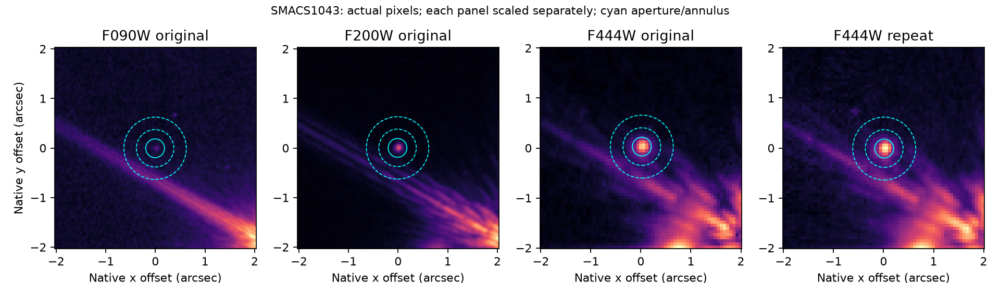

# Persistent SMACS1043 patch: blue-background and local-model anatomy

This second experiment follows merged PR #33 and the independent same-filter
repeat test. It examines nominated source 1043 after selection, preserving the
original catalogue and first-round evidence. No source identity, redshift or
discovery is claimed. The actual pixels show a compact F200W/F444W feature
alongside structured light from a bright neighbour. The original F090W negative
aperture flux is not robust to the assumed background model.



The panels use independently scaled asinh brightness. Their colours do not
encode cross-band flux ratios. Cyan circles locate the 0.188731-arcsec aperture
and 0.377462–0.629104-arcsec background annulus. The visible diagonal structure
crosses the annulus; its association with a bright neighbour's diffraction
pattern is an instrumental interpretation, not a new astrophysical result.

## Observations and explicit model families

The frozen position is RA 110.63858928243717°, Dec −73.48487214542632°.
The original F090W aperture has **−40.303 ± 6.446 nJy** under its mean annulus
and diagonal ERR assumptions. Its un-subtracted aperture is 609.449 nJy;
the annulus therefore subtracts about 649.752 nJy. A large shared background
dominates the signed residual. F200W's corresponding net flux is 664.240 nJy;
F444W is 1,263.116 nJy in the reference and 1,281.940 nJy in the distinct repeat.
The repeat spans 0.25648 hours and shares calibration with the reference.

We fit a signed point-template amplitude together with constant, plane or
quadratic backgrounds in bounded square halfwindows 0.45, 0.65 and 1.0 arcsec.
All SCI/ERR values are converted to nJy per native pixel with the actual WCS
calibration. Finite pinned JADES PSFs are integrated onto the native grid without
renormalizing cropped wings. Transport, orientation and unresolved-source
assumptions remain uncalibrated for this SMACS patch. Other frozen catalogue
cores are masked at 0.18 arcsec; this does not identify every contaminant.

An additional control fits only the background outside central radius 0.3 arcsec
and then measures the central aperture/template residual. The target's central
pixels do not set that background. PSF widths 0.9/1.0/1.1 and residual-cluster
widths 0.1/0.2/0.3 arcsec assess further assumptions. All amplitudes remain signed.

## Blue non-detection is background dependent

Across the nine unbroadened point-plus-background fits, F090W point parameters
are **+31.330 to +44.567 nJy**, with conditional residual-cluster standard errors
about 6.7–7.6 nJy. Width variation in the fiducial quadratic 0.65-arcsec window
gives +38.7 to +50.1 nJy. The original −6.25 diagonal-SNR aperture residual must
therefore not be treated as secure blue non-detection independently of the
background/point-source model.

This does **not** certify a blue astrophysical point-source detection. In the
source-excluded background controls, the central F090W aperture ranges
**−12.084 to +92.153 nJy** across the same window/background choices. Some fits
therefore admit a negative or nearly zero aperture while the forced point
parameter is positive. Polynomial descriptions cannot exactly model structured
diffraction light. Geometrical comparison positions elsewhere on that structure
also acquire positive point parameters; uncatalogued sources can contribute.

The direct result is failure of a background-independent interpretation of the
old negative blue residual. The original raw screen remains historical evidence;
its blue non-detection does not establish a calibrated dropout classification.
These models do not supply a clean revised high-redshift or low-redshift label.

## Compact red structure persists; precise point flux remains uncalibrated

| Image | Nine point parameters, nJy | Fiducial point parameter | Diagonal error | Residual-cluster error | Fiducial diagonal objective / dof |
|---|---:|---:|---:|---:|---:|
| F090W | 31.330–44.567 | 44.567 | 3.089 | 7.560 | 2637.87 / 1487 |
| F200W | 567.658–586.291 | 580.575 | 5.522 | 97.867 | 10501.95 / 1485 |
| F444W reference | 1502.961–1625.376 | 1570.929 | 10.195 | 144.093 | 4327.63 / 383 |
| F444W repeat | 1539.218–1653.805 | 1615.617 | 9.774 | 213.989 | 4727.22 / 386 |

The fiducial case is a quadratic background in a 0.65-arcsec halfwindow, with
unbroadened template and 0.2-arcsec residual groups. Its conditional normal
sandwich intervals are [29.750,59.385], [388.756,772.393],
[1288.508,1853.351] and [1196.198,2035.036] nJy, respectively. They are local-model
intervals; neither coverage nor independent source-detection probability is
calibrated by this experiment.

F444W reference and repeat retain strong positive compact parameters across
all tested windows, backgrounds and widths. Their source-excluded-background
science-aperture residuals are 1,245–1,285 nJy and 1,245–1,301 nJy, respectively.
This independently supports a persistent compact patch on structured light,
while explaining why segmentation might attach it to a larger feature.

The red point/background families have diagonal objective per degree of freedom
about **11–28**, and F200W about 7–17. The finite point template and polynomial
background are inadequate for precision inference. The large clustered errors,
width sensitivity and controls reinforce this limit. No Gaussian likelihood
ratio, calibrated detection significance, galaxy total flux or morphology label
is extracted from these objectives. In particular the very small formal errors
must not be used to claim precisely measured physical colours.

## Source and geometrical controls

The nearest other frozen proposal is 1039 at 0.87945 arcsec, and bright proposal
1033 lies 2.32638 arcsec away. The local fit masks proposal cores but does not
model the distant bright object's complete diffraction pattern. Eleven fixed
geometrical comparison positions on a 2.8-arcsec circle remain after a sign-blind
0.45-arcsec catalogue exclusion. They are off the nominated target, not certified
blank sky or independent observations. Near structured light, F090W point
parameters reach +61 nJy and F444W +719 nJy. Elsewhere they cluster nearer zero.
This rejects treating a fitted point coefficient as sufficient evidence of
source identity; it does not identify individual comparison features as artifacts.

## Reproduction and verification

All four actual input files and all three templates are independently rehashed
against merged inventories. The reference products retain PR #33's exact hashes;
the additional F444W image is
`jw02736001001_02105_00003_nrcalong_i2d.fits`, SHA256
`d06747dc62974e2e008b0a6e1f30c4864b1527e64218e73e210e97582e8aff8f`.
Catalogue and operator metadata hashes are checked. No new downloads are needed.
Compact fits/controls and the native-pixel figure are in
[`smacs1043_patch_diagnostics.json`](../research_output/smacs1043_patch_diagnostics.json).

```bash
python -m discovery.source_patch_diagnostics \
  --original-dir /path/to/original_round3 \
  --repeat-dir /path/to/smacs-repeat \
  --short-psf /path/to/pinned/f090w-f200w-models \
  --long-psf data_sources/pilot \
  --output research_output/smacs1043_patch_diagnostics.json
python -m pytest -q tests/test_source_patch_diagnostics.py \
  tests/test_empirical_imaging_controls.py
```

Four new synthetic controls recover signed point coefficients on known quadratic
backgrounds, expose simpler-background bias, detect grouped residual uncertainty
and forbid negative-index image wrapping. These validate code behaviour, not
the adequacy of these model families on real SMACS diffraction structure.

The next calibration should jointly model the bright neighbour and its rotated,
source/visit-specific PSF, test additional blue and intermediate filters, and
crossmatch a validated deep catalogue or spectrum. Compact persistence alone
cannot resolve stellar versus galaxy identity or high-redshift membership.
