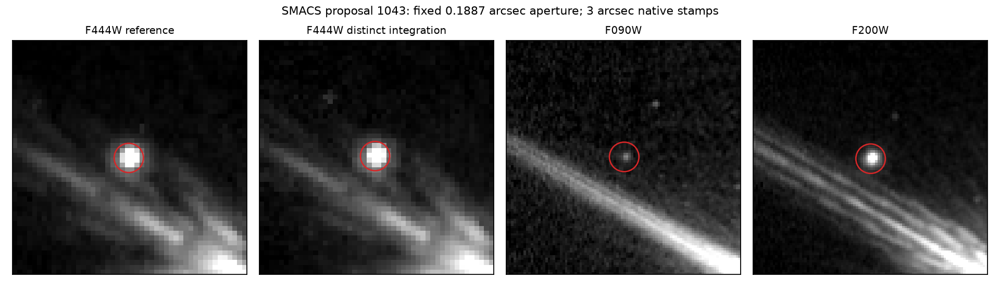

# Independent SMACS integration: nine unstable proposals and one stable aperture patch

Executed 9 October 2026 on verified master baseline `1b4012e`.
The **ten raw SMACS screen proposals** now have an equal-depth F444W repeat test:
nine fail a stable source at their reference brightness under nominal measurement
errors; proposal **1043 retains aperture signal**. Its nearest independently
segmented centroid is **0.951 arcsec away**, so this is persistence of the fixed
sky aperture, **not a confirmed separately identified object**. Bright-neighbor
blending is visible and needs source modeling. Neither this result nor the
original F090/F444 screen assigns a redshift, new source or detector-event cause.

## New data and actual independence

`data_sources/smacs_repeat_images.json` pins reference exposure `00004` and
new exposure `00003`. The new full original product is
`jw02736001001_02105_00003_nrcalong_i2d.fits`, **120,254,400 bytes**, SHA256
`d06747dc62974e2e008b0a6e1f30c4864b1527e64218e73e210e97582e8aff8f`.
Its HTTP receipt is checked in; raw inputs remain external. This is one new
114.684-MiB image under the allocated 150-MiB cap.

Both actual FITS products have `NDRIZ=1`, `CAL_VER=2.0.1`,
`CRDS_CTX=jwst_1535.pmap`, `FILTER=F444W`, `DETECTOR=NRCALONG`, and
837.468-s effective exposure time. Their embedded ASDF detector1 logs name
exactly one native `uncal` contributor each, with disjoint exposure identities.
The executable rejects mosaics, missing/multiple contributors, disguised input
identity and overlapping contributors before any repeat classification.
The actual EXPMID values give **0.25647972 hours** (15.3888 minutes).
These are distinct detector integrations within one visit, sharing calibration,
instrument and sky. They are not independent fields or independent calibration.

## New measurements and uncertainty limits

Before the comparison, all ten frozen reference aperture fluxes and errors
reproduce to relative tolerance `1e-9` from the original pixels. The fixed radius
is 0.18873115 arcsec; the background annulus is 0.37746230–0.62910384 arcsec.
Each image uses its own native WCS pixel areas and ERR plane. Required coverage
is at least 90%; missing measurements are never zero-flux nondetections.

| Raw proposal | Reference diagonal SNR | Repeat diagonal SNR | Nominal aperture result |
|---|---:|---:|---|
| 354 | 488.59 | -0.64 | Single epoch |
| 1090 | 427.25 | -1.81 | Single epoch |
| 337 | 271.64 | -2.98 | Single epoch |
| 464 | 324.02 | -1.71 | Single epoch |
| 14 | 182.71 | -0.55 | Single epoch |
| 334 | 149.94 | -0.54 | Single epoch |
| 17 | 200.45 | 0.40 | Single epoch |
| 1043 | 162.46 | 170.79 | Stable aperture patch; object association unresolved |
| 1070 | 16.33 | -0.87 | Single epoch |
| 152 | 7.46 | 2.33 | Single epoch under nominal errors |

1043 has repeat/reference aperture flux ratio **1.014903** and a formal
1.742-sigma flux difference. This does not imply variability or nonvariability
at a calibrated astrophysical confidence level. The nearest independent
5-sigma segment centroid remains outside the 0.2-arcsec association threshold.
The native four-band view shows a compact signal near a bright extended neighbor;
segmentation can merge components. A source/neighbor/PSF model is needed before
using it in an astrophysical catalog.

All ten nominal aperture outcomes are unchanged under four forced-center
perturbations of +/-0.05 arcsec in east/north. Tripling both flux errors leaves
**eight** proposals single epoch, retains 1043's aperture signal, and makes
**152 inconclusive**. Nominal flux discrepancies for the rejected nine range
7.091–488.478 sigma. These are diagonal conditional calculations. The threefold
error scale is an explicit sensitivity scenario, not a measured noise factor;
bright-source Poisson noise must not automatically inherit an empty-sky factor.
No empirical false-tail probability or cosmological abundance is inferred.



## Astrometry checked on held-out controls

Both F444W images are segmented independently at a fixed 5-sigma pixel threshold.
The ten selected proposal positions are excluded within 1 arcsec from frame
controls. There are **890 covered reference centroids, 697 one-to-one repeat
matches within 0.2 arcsec**. Reference-index parity splits them into 345 training
and 352 held-out controls, so the same centroids do not fit and certify the shift.

The fitted east/north median shift is **(-0.001984,+0.001243) arcsec**, with
finite-source bootstrap 95% intervals [-0.002802,-0.000948] and
[-0.000253,+0.002306] arcsec. Held-out raw median/p90 radial separation is
**0.01303/0.04451 arcsec**; subtracting the fitted shift gives
**0.01260/0.04527 arcsec**. Corrected component MAD widths are
**0.00964/0.01087 arcsec**. This supports relative registration; no fitted shift
is applied to the fixed-aperture science measurements.

The intervals omit image-wide calibration, galaxy morphology and selection
conditioning. Matches are conditional on detection in both images and a
0.2-arcsec match radius; they do not establish source completeness, absolute
Gaia-frame accuracy or per-candidate astrometric posterior uncertainty.

## Reproduce

With the locked research environment, provision both pinned products. Existing
reference cache reuse is optional; acquisition is bounded by the original-image
CLI's hard per-product and aggregate limits.

```bash
python -m data_pipeline.original_images data_sources/smacs_repeat_images.json \
  --output-dir /tmp/smacs-repeat --previous-dir /path/to/original_round3
python -m discovery.independent_repeat_vetting \
  /tmp/smacs-repeat/images_manifest.json \
  research_output/smacs_matched_image_rerun \
  --output /tmp/smacs-independent-repeat.json
python -m scripts.render_repeat_stamp /tmp/smacs-independent-repeat.json \
  /tmp/smacs-repeat/images_manifest.json \
  /path/to/original_round3/images_manifest_matched_smacs.json \
  --source-id 1043 --output /tmp/smacs-repeat-source1043.png
python -m pytest tests/test_independent_repeat_vetting.py \
  tests/test_external_astrometry.py tests/test_f444w_repeat_screen.py
```

The checked-in compact JSON pins inputs, retains all source denominators,
records each coverage/measurement state, all perturbations and each failed
centroid association. Synthetic tests independently protect self-veto,
mosaic/multiple-contributor failures, disguised filename identity, scalar/empty
centroid catalogs and a deliberately biased held-out translation counterexample.

## Follow-up and genuine dependencies

Accessible archive repeat coverage is now resolved for this selected SMACS patch.
Field-specific empirical noise/PSF sensitivity is delegated to the separate
noise workstream; no GOODS factor is transferred. The next tests are deblended
multiband source modeling of 1043 and native DQ/ramp controls for the eight strong
single-epoch events. The weaker 152 outcome needs measured faint-sky error tails.
Longer-baseline observations and spectroscopy remain necessary for any moving,
variable, high-redshift or physical-identity interpretation. The existing hour-
scale GOODS repeats and photometry are retained rather than restated as new work.
