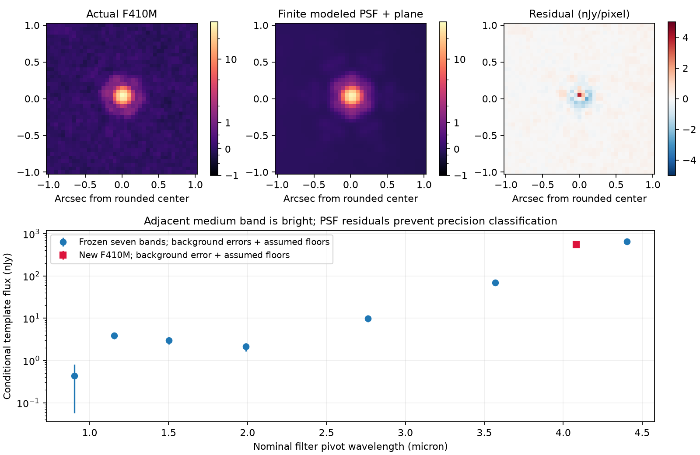

# Source46: actual F410M constrains the location of the red rise

After the finite Bobcat multiplicity exclusion and updated-chemistry pilot, the
next question is whether source46 is bright only inside the broad F444W band
or also in adjacent F410M. A negligible F410M signal would permit a F444-only
line excess; a bright counterpart would reject that particular premise while
leaving a broad molecular continuum **and lines overlapping both filters** open.
Expected information gain is the width/location of the rise, not source identity.

Before inspecting pixels, commit`4e766b6` declares the position, exact-footprint
coverage,≤8MiB new-input budget,120s computation budget and a stopping rule:
stop on missing coverage, calibration identity failure or sufficiently unstable
background/model flux that no useful ratio remains. The exposure query has30
F410M-CLEAR footprints containing the exact source, MJD59859.492–59876.836.
The cutout's44 global contributor files and76,961.168s exposure sum are different
denominators, not certified local depth or independent exposure counts.

The new science/weight cutout, official JADES DR5 modeled PSF and nominal SVO
passband total3,729,847bytes; the geometry-only CSV adds542,608bytes, for
**4,272,455 new selected bytes**, within8MiB. Actual SCI/WHT/FILTER/WCS,
positive local coverage, nominal photon-throughput identity and pinned byte
hashes are checked. The prior F444 pixels and passband and frozen seven-band
photometry are independently verified against their older contracts.

## Actual signed measurements and model inadequacy

The F444-derived source morphology/sky offset is transported to the F410 grid.
A signed finite-PSF coefficient and local background plane are fitted, with
0.35/0.50/0.65arcsec radii and0/30-degree PSF orientation alternatives. Small
formal uncertainties are not precision total-flux uncertainties.

| Diagnostic | Actual conditional result |
|---|---:|
| Fiducial F410M template coefficient |544.811nJy|
| Formal diagonal error |0.609nJy|
| Background-scaled error from59 disjoint blank operators |1.042nJy|
| Six radius/orientation coefficients |544.811–575.266nJy|
|0.15/0.20/0.30arcsec uncorrected apertures, two background annuli |331.752–418.549nJy|
| Free F410 centroid displacement from frozen F444 centroid |0.004675arcsec|
| Fiducial diagonal objective / linear dof |9819.372/525=18.704|
| All radius/orientation objectives / dof |18.704–95.853|

The compact counterpart stays positive with source-excluded background annuli
0.40–0.60 and0.60–0.90arcsec. Apertures intentionally omit PSF wing correction
and must not be compared as total fluxes. The tiny background scatter excludes
source Poisson noise, PSF/model uncertainty and measured calibration systematics.
Residuals are concentrated around the compact source, with a positive central
core and signed surrounding pattern. No explicit neighbor template is fitted;
PSF mismatch and contaminant light are not separated by the plane model.
Large structured source residuals expose inadequate PSF precision; a1.042nJy
error is not a calibrated total error or a significance claim. The centroid is
same-mosaic registration, not proper motion or parallax.



The bottom error bars include conditional background-scaled errors plus
**assumed15% individual and3% shared calibration floors**, not calibrated
confidence intervals. The top data/model images share brightness normalization;
residuals have a separate symmetric physical flux scale.

## Changed constraint and an explicit surviving counterexample

Using the frozen F444 coefficient644.880nJy gives conditional
**F410/F444=0.844826**. The actual adjacent-band emission rejects a F444-only
excess with negligible F410 contribution under these measurement choices.
It does **not** establish that the rise is a broad continuum or an atmosphere.

For a delta-like emission line at wavelengthλ, photon-integrated fnu is
proportional to`λ*T(λ)/integral(T/λ dλ)`. The same λ cancels between filters.
Actual pinned nominal passbands therefore admit a single-line explanation
with that ratio near **4.307–4.316µm**, when an illustrative15% ratio tolerance
and a5%-of-peak F444 transmission support guard are applied. This window is a
**conditional response degeneracy**, not a measured wavelength interval,
line detection, redshift posterior or class probability. Finite intrinsic
widths, multiple lines and a nonzero continuum alter it. No specific nebular
line or redshift is identified.

Even a bright medium band cannot by itself distinguish molecular structure
from a strong line at a filter edge. Another medium band sampling the opposite
side or a low-resolution spectrum would resolve a specific remaining ambiguity.
PSF calibration and physically complete galaxy/cloudy-atmosphere families remain
necessary for classification. No new high-redshift source or source identity
has been established.

## Dependence, reproduction and validation

Actual contributor lists are retained:44 F410 files versus68 F444 files, with no
identical file names. Different filters can reuse visits, calibration and the
same selected morphology; empty exact-file intersection does not establish
independent systematic errors. No likelihood multiplication or population
completeness inference is performed.

```bash
python -m data_pipeline.survivor_deep_data --output /tmp/jwst-deep
python -m discovery.survivor46_medium --input /tmp/jwst-medium --deep /tmp/jwst-deep \
  --photometry research_output/survivor_deep_model.json \
  --output /tmp/source46-medium.json
python -m discovery.survivor46_medium_plot --input /tmp/jwst-medium --deep /tmp/jwst-deep \
  --photometry research_output/survivor_deep_model.json --report /tmp/source46-medium.json \
  --output /tmp/source46-medium.png
python -m pytest tests/test_survivor46_medium.py tests/test_survivor_deep_model.py tests/test_survivor_deep_data.py
```

Absent medium products are restored only from the new independently pinned
manifest and verified before measurement. The module requires exact frozen
photometry/F444/passband hashes. Two new controls compare the analytic
narrow-line ratio with a separate direct photon integral and retain exact
contributor identities;14 relevant operator/data tests pass. Independent
actual-pixel/filter/geometry review must precede merge. The compact artifact
records all fits, controls, signed apertures, contributor lists and response
counterexample; it reports hypotheses without assigning source membership.

Independent PSF/data specialist review`82566ca` reproduces all six source
coefficients with an independent SVD solver within2.3e−13nJy, all six aperture
fluxes/errors, finite PSF integration and actual XML photon responses.
82.13% of the fiducial diagonal objective arises within0.2arcsec of the center,
confirming central model inadequacy without diagnosing its cause as a neighbor.
The line at4.3115µm independently gives the overlapping-band counterexample.
After fetching and merging live master with reviewed Flame PR62 at
`51d544b3d2854c5759914526cc4b791ed8621b59`, an actual-pixel F410 rerun
reproduces the frozen JSON **byte for byte** in the executed default thread
environment. The separate postmerge receipt preserves the dependency chain
without changing the independently pinned science artifact.
