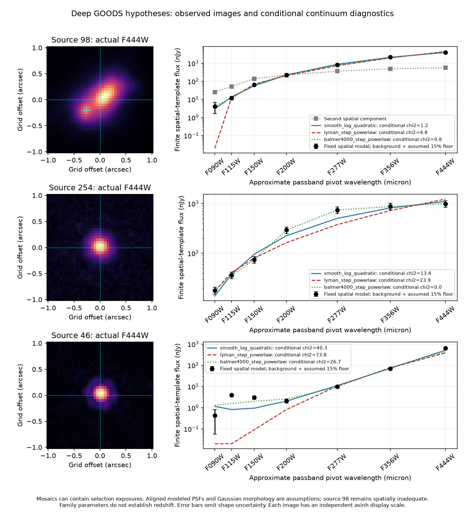

# Deep imaging: persistence does not certify a Lyman break

This experiment measures the three separately selected, persistent GOODS
hypotheses 98, 254 and 46 in the seven pinned deep DAWN bands introduced in
[SURVIVOR_DEEP_DATA.md](SURVIVOR_DEEP_DATA.md). These are actual images, with
explicitly conditional spatial and continuum models. No object is assigned a
physical redshift, stellar identity or new-discovery status.

## Method and error interpretation

Finite official JADES modeled PSFs are integrated onto the 0.05-arcsec output
grid without renormalizing cropped wings. The major width, axial ratio, angle
and position of an intrinsic elliptical Gaussian are fitted in F444W. Each
band then fits signed target-template flux, constant background and two local
background gradients at the same sky offset. A 0.65-arcsec fit radius is the
default. These modeled PSFs are not empirical DAWN PSFs; their axis alignment
and finite-wing totals are assumptions.

The actual flux-plus-background-plane operator is applied to disjoint,
source-masked blank locations in every cutout. Between 35 and 69 acceptable
locations are retained per band. Robust scatter of flux/formal-error ratios
supplies a background-only conditional covariance/confusion scale. We retain
the larger of that scale and one, without using sky scatter to reduce a formal
total error. This is not a shot-noise replacement or a calibrated significance
distribution. Formal flux covariance, signed measurements, ordinary/robust
background scatter and source masks are recorded in the
[machine-readable report](../research_output/survivor_deep_model.json).

Image-fit chi2 is a descriptive diagonal-pixel statistic. Large structured
residuals expose inadequate shapes; they do not become calibrated significance
claims. Changing the fit radius, point/extended shape, PSF rotation and band
centroid tests spatial sensitivity. Shape-parameter uncertainty is not included
in the quoted band error.

Versioned SVO photon-throughput curves are integrated as
`integral(fnu T dλ/λ)/integral(T dλ/λ)`; filter-label wavelengths are not used to
fit continua. Covariance for coarse continuum fits adds assumed independent
5% or 15% fractional floors plus a shared 3% term to the background-scaled
errors. These explicit floors are sensitivity choices, not measured calibration
posteriors. Coarse families are a smooth log-quadratic continuum, a zero-flux
1216-Angstrom step plus a power law (parameter range 6–20), a 4000-Angstrom step
with independently sloped sides and finite jump (range 0.3–6), and a blackbody.
The last three parameters are labels of phenomenological predictions; they
are not physical redshift or temperature estimates. Models omit realistic
stellar populations, dust, lines and IGM transfer.

## Results on actual images

| Band | Source 98 target in two-component model (nJy) | Source 254 (nJy) | Source 46 (nJy) |
|---|---:|---:|---:|
| F090W | 4.14 ± 2.45 | 17.84 ± 0.81 | 0.43 ± 0.37 |
| F115W | 11.87 ± 2.04 | 36.26 ± 0.76 | 3.91 ± 0.30 |
| F150W | 63.40 ± 2.49 | 73.99 ± 0.96 | 3.00 ± 0.33 |
| F200W | 223.38 ± 1.06 | 292.03 ± 0.38 | 2.12 ± 0.32 |
| F277W | 821.43 ± 1.94 | 739.37 ± 0.97 | 9.74 ± 0.47 |
| F356W | 2162.17 ± 1.72 | 877.70 ± 1.13 | 68.69 ± 0.44 |
| F444W | 3962.46 ± 1.97 | 987.49 ± 1.56 | 644.88 ± 0.58 |

Errors above are conditional background-scaled formal errors; **shape and
calibration floors are excluded**. Source 98 has plainly inadequate spatial
residuals, so its small formal errors do not justify physical total fluxes.

**254: a measured blue counterpart removes the original nondetection premise.**
Its F090W model flux is 17.84 ± 0.81 nJy after the empirical 1.20 background
scale from 66 blanks. The freely fitted blue centroid lies 0.010 arcsec from
the fixed F444 position. Fit radii 0.35/0.50/0.65 arcsec give
16.72/17.44/17.84 nJy; rotating the modeled PSF by 30 degrees gives 17.44 nJy.
The narrower same-centroid point model gives 10.82 nJy. Independently defined
0.15/0.20/0.30-arcsec apertures with a 0.40–0.60 background annulus give
15.77/19.01/24.64 nJy, with diagonal errors 0.77/1.05/1.76 nJy.
These all retain positive blue flux. No displaced bright blue knot is selected.
This rejects the operational claim that persistent 254 has no measured F090W
counterpart at this deeper depth. It does not exclude every high-redshift SED:
an inferred redshift still depends on physical break, dust and line models.

**98: a resolved multicomponent object makes colors depend on deblending.**
The F150W highest-SNR knot is offset (-0.268,-0.203) arcsec from the original
selection position, a 0.336-arcsec separation. A second compact spatial template
is fitted with independent signed band fluxes. It reduces F444 diagonal chi2
from 562,002 to 184,658 for about 525 linear degrees of freedom, yet the residual
remains grossly structured. The target F090W flux changes from 10.16 nJy in the
single Gaussian to 4.14 nJy with the second component; decreasing fit radius
to 0.35 arcsec gives -0.71 nJy. The companion contributes 25.46 nJy in F090W
and 138.67 nJy in F150W. The target's blue centroid repeatedly reaches the
allowed 0.1-arcsec shift boundary. Neither blue-flux assignment nor a shared
single-component SED is certified. This does not identify the knot as a
foreground object or as part of one galaxy.

**46: an almost pointlike source has strong curvature rather than a simple break.**
Point and broadened F444 fits give effectively identical flux and chi2; their
fitted tiny Gaussian widths are sampling-dependent nuisance values, not a size
measurement. Its F444/F356 flux ratio is about 9.39, while F356/F277 is about
7.05. F115/F150/F200 fluxes are about 3.91/3.00/2.12 nJy and have local centroid
offsets of order 0.005–0.014 arcsec in the adopted model. Even with the assumed
15% fractional floor, all tested coarse continuum families leave substantial
residuals. A physical cool-atmosphere spectrum, emission-line galaxy model and
source-specific empirical PSF are useful next competing predictions. No dwarf,
galaxy or artifact identity follows from these ratios.

## Conditional continuum-family comparison

| Source | Assumed independent floor | Smooth chi2 / 4 dof | 1216-step chi2 / 4 dof | 4000-step chi2 / 2 dof | Blackbody chi2 / 5 dof |
|---|---:|---:|---:|---:|---:|
| 98, deblended target | 5% | 4.29 | 20.14 | 7.32 | 126.69 |
| 98, deblended target | 15% | 1.21 | 4.82 | 0.82 | 25.93 |
| 254 | 5% | 99.83 | 182.23 | 0.12 | 230.08 |
| 254 | 15% | 13.41 | 23.89 | 0.02 | 43.99 |
| 46 | 5% | 105.11 | 208.82 | 90.01 | 248.47 |
| 46 | 15% | 40.27 | 73.84 | 26.71 | 89.92 |

Different family flexibility, optimized parameter boundaries, correlated
systematics and inadequate source shapes prohibit converting this table into
Bayes factors, calibrated rejection probabilities or redshift posteriors.
For 254 a large finite break near the F200W region fits better than a
simple 1216-step family; that prediction can guide physical SED fitting.
For 98 the apparent discrimination weakens under systematic floors and spatial
changes. For 46 no tested simple family explains the multiband curve.



## Reproduce and next experiments

```bash
python -m data_pipeline.survivor_deep_data --output /tmp/jwst-deep-survivors
python -m discovery.survivor_deep_model \
  --input /tmp/jwst-deep-survivors \
  --output /tmp/survivor-deep-model.json
python -m discovery.survivor_deep_plot \
  --input /tmp/jwst-deep-survivors --report /tmp/survivor-deep-model.json \
  --output /tmp/survivor-deep-model.png
python -m pytest tests/test_survivor_deep_data.py tests/test_survivor_deep_model.py
```

Nine analytic controls independently verify signed flux/background recovery,
two-component flux covariance against SVD, masked pixels, finite-wing accounting,
photon integration, corrupt cached receipts and exact science/blank companion geometry. Three acquisition tests enforce
the pinned cache and byte-ceiling contract. Baseline continuum/deep-reference/
photometry sensitivity checks gave 15 passes before these extensions.

Highest-value next tests: independently repeat 254 blue photometry with different
annuli and planar sky; constrain 98 with flexible multicomponent empirical PSFs
and deblending against optical imaging; fit versioned stellar-atmosphere versus
nebular+dust population models for 46. All three need genuinely disjoint repeat
contributor sets and physical SED libraries before a reliable redshift or source
identity. The three selected objects cannot estimate population contamination,
completeness, halo abundance or cosmological tension.

An independent review caught and corrected a blank-template phase mismatch before
merge: the original background control recentered only the target while leaving
its companion shifted. Blank fits now preserve the exact science centroid,
phase and relative component separation. All empirical errors and continuum
scenarios above were regenerated after that correction; measured science fluxes
remain unchanged. A nonzero-phase companion regression tests this contract.
